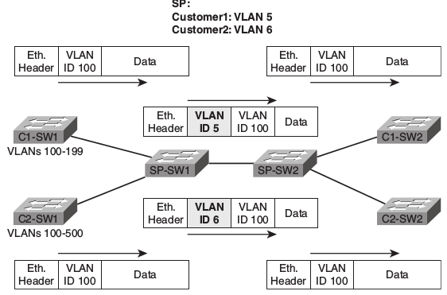

= 802.1Q-in-Q tunneling

== Concepts

- adds a metro tag or PE-VLAN to the 802.1q tagged packets
- expands the VLAN space by double-tagging frames
- allows Service Providers 
 * to preserve 802.1Q VLAN tags accross WAN links.
 * to provide services such as Internet access on specific VLANs for specific customers,
yet providing other services on other VLANs 

.Q-in-Q: basic operation

== Frame 

image::images/q-in-q-frame.png[802.1Q-in-Q frame]

=== Frame size

- recommended minimum MTU: 1504 bytes 
  * default MTU: 1500 bytes
  * outer VLAN tag: 4 bytes

=== TPID

- contains the modified tag protocol identifier
- set to 0x8100 for IEEE 802.1q

The QinQ frame contains the modified tag protocol identifier (TPID) value of
VLAN Tags. By default, the VLAN tag uses the TPID field to identify the
protocol type of the tag. The value of this field, as defined in IEEE 802.1Q,
is 0x8100.

The device determines whether a received frame carries a service provider VLAN
tag or a customer VLAN tag by checking the corresponding TPID value. After
receiving a frame, the device compares the compares the configured TPID value
with the value of the TPID field in the frame. If the two match, the frame
carries the corresponding VLAN tag. For example, if a frame carries VLAN tags
with the TPID values of 0x9100 and 0x8100, respectively, while the configured
TPID value of the service provider VLAN tag is 0x9100 and that of the VLAN tag
for a customer network is 0x8200, the device considers that the frame carries
only the service provider VLAN tag but not the customer VLAN tag.

In addition, the systems of different vendors might set the TPID of the outer
VLAN tag of QinQ frames to different values. For compatibility with these
systems, you can modify the TPID value so that the QinQ frames, when sent to
the public network, carry the TPID value identical to the value of a particular
vendor to allow interoperability with the devices of that vendor. The TPID in
an Ethernet frame has the same position with the protocol type field in a frame
without a VLAN tag. In order to avoid problems in packet forwarding and
handling in the network, you cannot set the TPID value to any of the values in
this table:

[options="header",format="dsv"]
|====
 Protocol type : Value
 ARP           : 0x0806
 PUP           : 0x0200
 RARP          : 0x8035
 IP            : 0x0800
 IPv6          : 0x86DD
 PPPoE         : 0x8863/0x8864
 MPLS          : 0x8847/0x8848
 IS-IS         : 0x8000
 LACP          : 0x8809
 802.1x        : 0x888E
|====

The QinQ Support feature is generally supported on whatever Cisco IOS features
or protocols are supported. For example, if you can run PPPoE on the
subinterface, you can configure a double-tagged frame for PPPoE. IPoQinQ
supports IP packets that are double-tagged for QinQ VLAN tag termination by
forwarding IP traffic with the double-tagged (also known as stacked) 802.1Q
headers.
