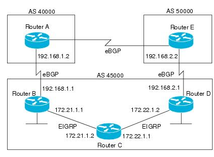

= BGP
:icons: font
:experimental:

menu:Configuration guides[IP Routing > http://www.cisco.com/c/en/us/td/docs/ios-xml/ios/iproute_bgp/configuration/15-mt/irg-15-mt-book/configuring_a_basic_bgp_network.html[BGP] ]

== Concepts 

- Exterior gateway protocol 
- Creates loop-free inter-domain routing between AS.
- Path vector algorithm = (distance vector + AS-path loop detection)
- TCP 179  
- AD: external 20 , internal and local 200 
- RFC 1771

=== When to use BGP

// improve this part
- Multiple connections to Internet via different providers
- Multiple connections to external ASs via the same provider but different routing policy

=== Autonomous systems

- AS: set of routers under a single technical administration
- AS can be:
  * stub : only one exit
  * multihomed: multiple connections with the one or multiple providers
    ** transit: allows traffic with origin and destination outside the AS
    ** non-transit:  

==== ASN format

- 2-byte (RFC 4271) 
  * 0 - 65535
  * reserved: 0, 65535
  * public use: 1 - 64495
  * documentation: 64496-64511 (RFC 5398)
  * private use: 64512 - 65534

- 4-byte (RFC 5396) 
  * Asplain: decimal value notation for 2-byte and 4-byte ASNs 
  * Asdot: decimal value notation for 2-byte and dot notation for 4-byte ASN 
  * Documentation: 65536-65551 (RFC 5398) 

- AS 23456: reserved for gradual transition from 2-byte to 4-byte (RFC 4893) 

== BGP peers

- Manually configured and not automatically discovered
- Formed over a TCP connection
- Exchanges NLRI
- Starts with full BGP routing table then incremental updates
- Keep table version number

iBPG peers ::
  - same AS
  - must be fully meshed within AS

eBGP peers ::
  - different AS
  - by default, one hop away but you can change that with *ebgp-multihop* 
  
== BGP message format

- Minimum size: 19 bytes
- Maximum size: 4096 bytes (why?)

.BGP header format
["packetdiag", target= 'tcp-header-format']
----
{
  colwidth = 32
  node_height = 32
  default_node_color = lightyellow
  default_fontsize = 12

  * Marker [len = 128]
  * Length [len = 16]
  * Type [len = 8]
}
----

* Marker: 
  - 16 bytes 
  - set to all 1s for OPEN message or if OPEN message without authentication
  - computed by the authentication process

* Length: 
  - 2 bytes
  - total length in bytes of the message including the header

* Type: 
  - 1 byte
  - indicates message type (1: Open, 2: Update, 3: Notification, 4: Keepalive)

==== OPEN

- Initiates the session
- Contains BGP version , local AS number, BGP router Id

["packetdiag", target="bgp-open"]
----
diagram {
  colwidth = 32
  node_height = 32
  default_node_color = lightyellow
  default_fontsize = 12

  * [len = 24, color=white] 
  * Version [len=8]
  * My Autonomous System [len = 16]
  * Hold Time [len= 16]
  * BGP Identifier [len=32]
  * Opt Param Len [len=8]
  * Optional Parameters [len=56]
}
----

- Version: 1 octet 
- My autonomous system: 
- Hold time: 
  * maximum interval in seconds between successive Keepalive  or Update messages.
  * A receiver compares the value of the Hold Time and the value of its configured hold time
  and accepts the smaller value or rejects the connection. 
  * Can be set to zero to indicates that the connection is always up //find a better formulation 
  * if not set to zero, the minimum recommended hold time is 3 seconds
  
- BGP identifier: 
  * router ID 
  * determined by these rules in order of preference at boot or bgp process restart:
    ** manually configured router id
    ** highest IP address of an up/up loopback 
    ** highest IP address of an up/up non-loopack 

- Optional parameters length: 
  - total length in octects of the following Optional Parameters field

- Optional Parameters: 
  - Variable length field containing a triplet <Type: 1 octet,Length: 1 octet,Value>

==== KEEPALIVE

- Every 60 seconds
- Hold-time: 180 seconds

==== UPDATE

- Advertises a single feasible route to a peer and/or withdraws multiple unfeasible routes

.header format
["packetdiag", target=""]
----
diagram {
  colwidth = 32
  node_height = 32
  default_node_color = lightyellow
  default_fontsize = 12

  * Unfeasible Routes Length [len = 16, color = yellow]
  * Withdrawn Routes (variable) [len = 48, style=dashed]
  * Total Path Attribute Length [len=16, color = yellow]
  * Path Attributes (variable) [len=48, style=dashed]
  * Network Layer Reachability Information (variable) [len=64,style=dashed]
}
----

- Unfeasible Routes Length
  * 2-octet field 
  * total length of the following Withdrawn Routes field, in octets. 

- Withdrawn Routes 
  * variable-length 
  * lists routes to be withdrawn from service. 
  * Each route in the list is described with a (Length, Prefix) tuple in which the Length is
the length of the prefix and the Prefix is the IP address prefix of the withdrawn route. 

- Total Path Attribute Length
  * 2-octet 
  * total length of the following Path Attribute field, in octets. 

- Path Attributes 
  * variable-length 
  * lists the attributes associated with the NLRI in the following field. 
  Each path attribute is a variable-length triple of (Attribute Type, Attribute
Length, Attribute Value). The Attribute Type part of the triple is a 2-octet field consisting of
four flag bits, four unused bits, and an Attribute Type code (see <<AttributeTypeCode>>).

.Attribute Type part of the Path Attributes field
["packetdiag", target="bgp-attribute"]
----
diagram {
  colwidth = 32
  node_height = 32
  default_node_color = lightyellow
  default_fontsize = 12

  * O [len=1 ]
  * T [len=1 ]
  * P [len=1 ]
  * E [len=1 ]
  * Unused [len=4, color=lightgrey]
  * Attribute Type Code [len=8]
}
----

Flag bits (1/0)::
- O: Optional / Well-known 
- T: Transitive / Non-transitive
- P: Partial / Complete
- E: Extended length / Regular length ( 2-bytes/ 1-bytes)
- U: Unused 

[[AttributeTypeCode]]
.Attribute Type Code
[format="dsv",options="header",cols="10,40,40"]
|===
Code : Attribute        : Category
1    : ORIGIN           : Well-known mandatory
2    : AS_PATH          : Well-known mandatory
3    : NEXT_HOP         : Well-known mandatory
4    : MULTI_EXIT_DISC  : Optional nontransitive
5    : LOCAL_REF        : Optional transitive
6    : ATOMIC_AGGREGATE : Well-known discretionary
7    : AGGREGATOR       : Optional transitive
8    : COMMUNITY        : Optional transitive
9    : ORIGINATOR_ID    : Optional nontransitive
10   : CLUSTER_LIST     : Optional nontransitive
255  : Reserved
|===

NOTE: tasks for Internet, no-export, no-advertise, local-as 

==== NOTIFICATION

  - go out in response to error, fatal condition 
  - torn down or reset the BGP peer session

==== BGP FSM States

.BGP neighbor negotiation finite state machines
[graphviz]
----
digraph bgp_fsm {
  rankdir=LR
  Idle [fillcolor="yellow",style=filled] 
  Idle -> Idle 
  Idle -> Connect 
  Connect -> Idle
  Connect -> Connect
  Connect -> Active 
  Active -> Idle
  Active -> Connect
  Active -> Active
  Active -> OpenSent [label="OPEN"]
  Connect -> OpenSent  [label="OPEN"]
  OpenSent -> OpenConfirm
  OpenSent -> Active
  OpenSent -> Idle
  OpenConfirm -> Idle
  OpenConfirm -> OpenConfirm [label="KEEPALIVE" ]
  Established [fillcolor="green",style=filled]
  OpenConfirm -> Established
  Established -> Idle [label= "NOTIFICATION"]
  Established -> Established [label="KEEPALIVE UPDATE"]
}
----

-  *Idle* – initial BGP state after enabling BGP process or resetting device. 
-  *Connect* - waits for a TCP connection with the remote peer. If
successful, sends OPEN message. If not, resets the ConnectRetry timer and transitions to Active state.
-  *Active* – attempts to initiate a TCP connection with the remote
peer. If successful, sends OPEN message. If not, resets ConnectRetry timer and transitions back to Connect state
-  *OpenSent* – TCP connection up and OPEN message sent,  transition to OpenReceive state and wait for initial
keepalive to move into OpenConfirm state.
If TCP session disconnect, terminate BGP session, reset ConnectRetry timer, move back to Active State.
-  *OpenConfirm* – OPEN messages sent and received. Wait for KEEPALIVE
-  *Established* – KEEPALIVE received, neighbor parameters match. the BGP peer session is fully established. UPDATE
messages containing routing information will now be sent.

- If peer stuck in *Active* state, potential problems can include:
  * no IP connectivity
  * incorrect *neighbor* statement
  * access-list filtering TCP port 179

=== BGP session reset

- Whenever the routing policy changes due to a configuration change
- Reset with *clear ip bgp*
- Can be hard reset, soft reset or dynamic inbound soft reset

==== Hard reset 

- Tears down the peering sessions including the TCP connections
- Deletes prefixes learned from the peers. 
- Pros: no memory overhead

==== Soft reset 

- Stores prefix information
- Do not tearn down existing peering sessions
- Can be configured for inbound or outbound sessions

==== Dynamic inbound soft reset 

- Do not store update information locally
- Relies on dynamic exchanges with supporting peers
- The peers supports the capability if  *show ip bgp neighbors* displays  
  _Received route refresh capability from peer_ .
- Use *bgp soft-reconfig-backup* to store updates for peers who do not support the refresh route capability

=== BGP route aggregation

- 2 methods
  * basic route redistribution: creates an aggregate route, then redistributes the routes in BGP
  * conditional aggregation: creates an aggregate route , then advertises or not certain routes 
  based on route maps, AS-SET, or summary information

- *bgp suppress-inactive* stops BGP to advertise inactive routes (not installed
  into the RIB) to any peer. 

==== BGP route aggregation generating AS_SET information

#TODO: improve this part

AS_SET information can be generated when BGP routes are aggregated using the
aggregate-address command. The path advertised for such a route is an AS_SET
consisting of all the elements, including the communities, contained in all the
paths that are being summarized. If the AS_PATHs to be aggregated are
identical, only the AS_PATH is advertised. The ATOMIC-AGGREGATE attribute, set
by default for the aggregate-address command, is not added to the AS_SET.

=== Routing policy change management 

TODO: add this part under bgp reset

=== BGP peer groups

- Group of peers with the same update policies ( outbound route maps, distribute lists, filter lists, update source ,)
- Benefits: 
  * simplify configuration
  * make configuration updates more efficient

- Restrictions for eBGP peers:

=== BGP backdoor routes

- Use *network backdoor* to cause BGP to prefer EIGRP 

=== Best path selection algorithm

. highest weight
. highest local pref
. locally originated paths over externally originated paths
. shortest AS path
. lowest origin type ( internal over external over incomplete)
. lowest MED
. eBGP paths over iBGP paths
. lowest IGP cost
. oldest path
. lowest BGP router id

TIP: “We Love Oranges AS Oranges Mean Pure Refreshment”.
W Weight (Highest) L Local_Pref (Highest) O Originate (local originate) AS
As_Path (shortest) O Origin Code (IGP < EGP < Incomplete) M MED (lowest) P
Paths (External Paths preferred Over Internal) R Router ID (lowest) 

=== community attributes

- No-advertise: prevents advertisements to any BGP peer
- No-export: prevents advertisements to any eBGP peer
- No-advertise: prevents advertisements outside the AS, or in confederation scenarios, outside the sub-AS
- Internet:  advertises routes to any route

== Configuration tasks

=== Configuring a BGP Routing Process

- Configure a bgp routing process 

----
router bgp <asn>
----

- Specify a network as  local to the BGP routing table 

----
network <prefix> [mask  <a.b.c.d>] [route-map <name>]
----

- Configure the bgp router id 

----
bgp router-id <ip-address>
----

- Set the bgp network timers

----
(config-router)# timers bgp <keepalive-seconds> <holdtime-seconds>
----

=== Configuring a BGP Peer

----
neighbor <ip-address> remote-as <asn>
----

- Specify the IPv4 address family 

----
(config-router)# address-family ipv4 [unicast | multicast | vrf <name>]
----

- Enable the neighbor to exchange prefixes for the ipv4 unicast address family with the local device

----
(config-router)# neighbor <ip-address> activate
----

=== Configuring a BGP Peer for the IPv4 VRF Address Family

- Associate a vpn vrf instance with an interface

----
(config-if)# interface <type> <number> 
(config-if)# vrf forwarding <name>
(config-if)# ip address <prefix> <mask> [secondary [vrf <name>]]
----

- Configure a VRF routing table with the same name assigned to the VRF 
  and enters the VRF configuration mode

----
(config)# ip vrf <name>
----

- Create routing and forwarding tables and specify the default route distinguisher for a vpn

----
(config-vrf)# rd <route-distinguisher>
----

- Create a route target extended community for a VRF

----
(config-vrf)# route-target [import | export | both] <community>
----

=== Customizing a BGP Peer

- Disable the IPv4 unicast address family for the BGP routing process

----
no bgp default ipv4-unicast
----

- Add a neighbor

----
(config-router)# neighbor <ip-address> remote-as <asn>
----

- Add a text description with a specified neighbor

----
(config-router)# neighbor <ip-address> description <text>
----

- Add a text description with a specified peer group

----
(config-router)# neighbor <peer-group-name> description <text>
----

- Exit address family configuration mode 

----
(config-router-af)# exit-address-family
----

- Disable a BGP peer or peer group

----
(config-router)# neighbor <ip-address> shutdown
----

=== Monitoring and Maintaining Basic BGP

- Enable logging of BGP neighbor resets

----
(config-router)# bgp log-neighbor-changes
----

- Configure a BGP speaker to perform inbound soft reconfiguration 
  for peers that do not support the route refresh capability.

----
(config-router)# bgp soft-reconfig-backup
----

- Start storing updates for each neighbor that do not support route refresh 

----
(config-router)# neighbor <ip-address|peer-group-name> soft-reconfiguration [inbound]
----

[NOTE]
====
- All the updates received from this neighbor will be stored unmodified,
  regardless of the inbound policy. When inbound soft reconfiguration is done
  later, the stored information will be used to generate a new set of inbound
  updates.

- Memory requirements can increased.
====

- Apply a route map to incoming or outgoing routes

----
(config-router)# neighbor <ip-address|peer-group-name> route-map <name> [in | out] 
----

=== Aggregating Route Prefixes Using BGP

- Redistribute static routes into the BGP routing table 

----
(config-router)# redistribute static
----

- Create an aggregate entry in a BGP routing table 

----
(config-router)# aggregate-address <prefix> <mask> [as-set]
----

- Create an aggregate route and suppress advertisements of more-specific routes to all peers

----
(config-router)# aggregate-address <prefix> <mask> [summary-only]
----

- Create an aggregate route but suppress advertisement of specified routes

----
(config-router)# aggregate-address <prefix> <mask> [suppress-map <map-name>]
----

- Selectively advertises routes previously suppressed by the *aggregate-address* command 

----
(config-router)# neighbor <ip-address | peer-group-name> unsuppress-map <map-name> 
----

- Conditionally advertise BGP routes

The routes or prefixes that will be conditionally advertised are defined in two
route maps: an advertise map and either an exist map or nonexist map. The route
map associated with the exist map or nonexist map specifies the prefix that the
BGP speaker will track. The route map associated with the advertise map
specifies the prefix that will be advertised to the specified neighbor when the
condition is met.

- If a prefix is found to be present in the exist map by the BGP speaker, the
  prefix specified by the advertise map is advertised.  

- If a prefix is found not to be present in the nonexist map by the BGP
  speaker, the prefix specified by the advertise map is advertised.  

- If the condition is not met, the route is withdrawn and conditional
  advertisement does not occur. All routes that may be dynamically advertised
  or not advertised must exist in the BGP routing table in order for
  conditional advertisement to occur. These routes are referenced from an
  access list or an IP prefix list.

- Advertise selectively some BGP routes to neighbor

----
(config-router)# neighbor <ip-address> advertise-map <name-1> { exist-map <name> | non-exist-map <name>}
----

- Inject more specific prefixes into a BGP routing table over less specific prefixes 

----
(config-router)# bgp inject-map <name> exist-map <name> [copy-attributes]
----

=== Originating BGP Routes

- Advertise a default route to BGP peers

----
(config-router)# neighbor <ip-address> default-originate  [route-map <name>]
----

- Indicate a network reachable through a backdoor route

----
(config-router)# network <ip-address> backdoor
----

TIP: BGP only advertize networks in the RIB

=== Configuring a BGP Peer Group

- Create a BGP peer group

----
(config-router)# neighbor <peer-group-name> peer-group
----

- Assign a neighbor to a peer group

----
(config-router)# neighbor <ip-address> peer-group <name>
----

=== Modify the default output and regex match format for 4-byte ASN

----
(config-router)# bgp asnotation dot
----

=== Suppress inactive route advertisement using BGP

- Suppress inactive route advertisement

----
(config-router-af)# bgp suppress-inactive
----

=== Configure basic peer session template

- Create a peer session template

----
(config-router)# template peer-session <name>
----

- Inherit the configuration of another peer session template

----
(config-router-stmp)# inherit peer-session <template-name> 
----

- Send a peer session template to a neighbor so that the neighbor can inherit the configuration

----
(config-router)# neighbor <ip-address> inherit peer-session <template-name> 
----

=== configure basic peer policy template

- Create a peer policy template

----
(config-router)# template peer-policy <name> 
----

- Configure the maximum number of prefixes that a neighbor will accept from this peer

----
(config-router-ptmp)# maximum-prefix <limit> [<threshold>] [restart <interval> | warning-only]
----

[NOTE]
- A peer policy template can directly or indirectly inherit up to 8 peer
  policy templates.

- A BGP neighbor cannot be configured to work with both peer groups and peer
  templates. A BGP neighbor can be configured to belong only to a peer group or
  to inherit policies only from peer templates.

== Verify 

- Display the entries in the bgp routing table

----
show ip bgp [prefix] [mask]
----

- Display info about the TCP and BGP connection to neighbors

----
#  show ip bgp neigbors <ip-address>
----

//todo: split this command  
//# show ip bgp neighbors [ip-address] [received-routes | routes | advertised-routes | paths regexp | dampened-routes | received prefix-filter] 
//# show ip bgp [network-address] [network-mask] [longer-prefixes] [prefix-list prefix-list-name | route-map route-map-name] [shorter prefixes mask-length] 

- Verify that the VRF instance has been created

----
# show ip vrf
----

- Display information about all the BGP paths in the database

----
# show ip bgp paths
----

- Display the status of all BGP connections 

----
# show ip bgp summary
----

- Display IPv4 multicast database-related information

----
show ip bgp ipv4 multicast <command>
----

- Display injected paths

----
# show ip bgp injected-paths

BGP table version is 11, local router ID is 10.0.0.1
Status codes:s suppressed, d damped, h history, * valid, > best, i -
internal
Origin codes:i - IGP, e - EGP, ? - incomplete
   Network          Next Hop            Metric LocPrf Weight Path
*> 172.16.0.0       10.0.0.2                               0 ?
*> 172.17.0.0/16    10.0.0.2                               0 ?
----

- Display update replication stats for BGP update groups

----
# show ip bgp replication [<index-group> | <ip-address>] [summary]
----

- Display BGP routes that are not installed in the RIB

----
# show ip bgp rib-failure

Network            Next Hop                      RIB-failure   RIB-NH Matches
10.1.15.0/24       10.1.35.5           Higher admin distance              n/a
10.1.16.0/24       10.1.15.1           Higher admin distance              n/a
----

- Display locally configured peer session template

----
show ip bgp template peer-session
----

== Troubleshoot

- Verify basic network connectivity between BGP devices

----
ping vrf
----

- Clear and reset BGP neighbor sessions

----
# clear ip bgp *
----

- Clear BGP update group membership and recalcultar BGP update groups
 
----
# clear ip bgp update-group [ <index-group> | <ip-address> ]
----

- Display info about the processing of BGP update groups.

----
# debug ip bgp groups
----

== todos

- Concept: bgp route aggregation generating AS_SET information
- Multiprotocol bgp concepts
- Multiprotocol bgp extensions for IP multicast concepts 
- AFI bgp address family identifier model : ipv4, ipv6,clns, vpnv4

