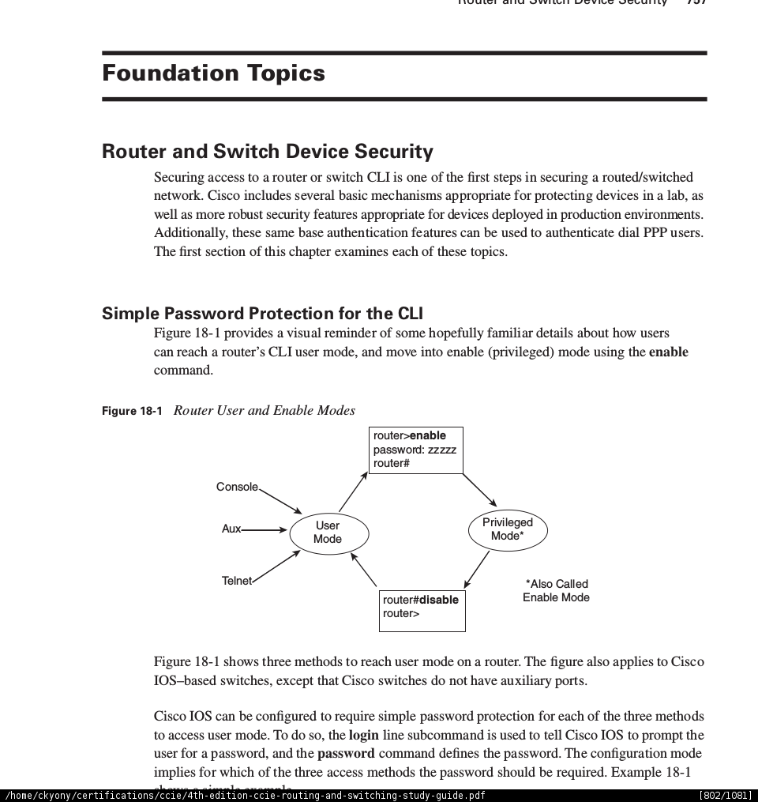

= Device security

== Passwords protection for the CLI

--todo: replaces images by graphviz 

- *login* line subcommand prompts the user for a password from console, telnet, aux (only routers)
- *enable* access user mode 

----
line con 0
  login
  password fred
----

- *service passwordr-encryption* encrypt all existing clear-text password in the running-config.
- weak encryption, can be broken easily

- enable secret 

==  using SSH

- by default , routers and switches can act as SSH clients
- to configure SSH server

. Use K9 image for SSH support
. configure host name
. configure domain name
. configure a client authentication method
. generate RSA keys
. specify the SSH version
. disable telnet on the vty lines
. enable SSH on the vty lines

//show below an example

== Use AAA for user mode and privileged mode

.Radius vs TACACS+
Criteria            , RADIUS        , TACACS+
scope of encryption , password only , entire payload
Layer 4 protocol    , UDP           , TCP
Well-knon port      , 1812          , 49
IOS default port    , 1645          , 49
Standard            , RFC 2865      , Cisco

== readings 

http://www.cisco.com/en/US/docs/ios-xml/ios/iproute_ospf/command/ospf-a1.html#wp258289[Guide to harden Cisco IOS devices]

