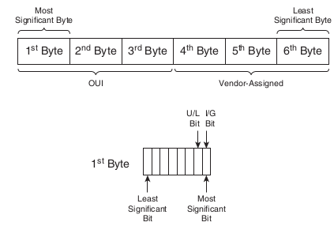
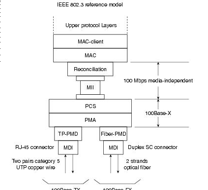
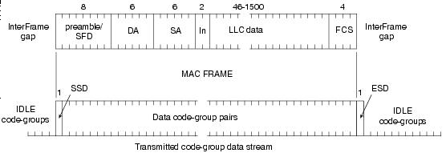

= Ethernet technologies

== Introduction

The term Ethernet refers to the family of LAN products 
covered by the IEEE 802.3 standards that defines what is commonly known as the CSMA/CD protocol. 

Four data rates are currently defined for operation over coaxial, twisted-pair and optical fiber cables:

[compact]
-    10 Mbps: Ethernet
-    100 Mbps: Fast Ethernet
-    1000 Mbps: Gigabit Ethernet 
-    10000 Mbps: 10-gigabit  Ethernet

== History

- 1973-74: Xerox PARC Experimental coaxial cable network 3Mbps Inspired by ALOHAnet which Robert Metcalfe had studied as part of his PhD dissertation
- 1980: DIX version 1 Standarized by DIX (digital Equipment Corporation, Intel and Xerox)
- 1982: DIX version 2 
- 1985: 802.3 standard

== Ethernet elements and topologies

Ethernet LANs consist of network nodes and interconnecting media.

The network nodes fall into 2 major classes:

- DTE Data terminal equipment: 
** devices that are either the source or destination of data frames.
** examples of end-stations: PCs, workstations, file or print servers, ...

- DCE Data communication equipment:
** devices that receive and forward frames accross the network .
** examples of intermediate devices: repeaters, hubs, switches, modems, 

Ethernet LANs can be the combination of these 3 basic structures:

- Point-to-point interconnection

  ** Only two nodes involved on the link
  ** Can be DTE-DTE, DCE-DCE or DTE-DCE
  ** Max. length of the link depends on the type of the cable and the transmission method. 

- Coaxial bus topology

  ** Used in the original ethernet networks
  ** Segment length limited to 500 meters
  ** Up to 100 stations could be connected to a single segment. 
  ** Individual segments could be interconnected with repeaters if no multiple paths between any two stations and the total number of DTEs is < 1024
  ** The total path distance between the most-distant pair of stations was not allowed to exceed a maximum prescribed value.

- Star topology
  ** with hub or switch
  ** using twisted-pair or optical fiber cable

== IEEE 802.3 Logical Layer relationship to the ISO reference model

The MAC-client sublayer may be one of the following:

-    Logical Link Control (LLC), if the unit is a DTE. This sublayer provides the interface between the Ethernet MAC and the upper layers in the protocol stack of the end station. The LLC sublayer is defined by IEEE 802.2 standards.
-    Bridge entity, if the unit is a DCE. Bridge entities provide LAN-to-LAN interfaces between LANs that use the same protocol (for example, Ethernet to Ethernet) and also between different protocols (for example, Ethernet to Token Ring). Bridge entities are defined by IEEE 802.1 standards. 

Because specifications for LLC and bridge entities are common for all IEEE 802 LAN protocols,
network compatibility becomes the primary responsibility of the particular network protocol.

The figure below shows different compatibility requirements imposed by the MAC and physical levels for basic data communication over an Ethernet link.

The MAC layer controls the node's access to the network media 
and is specific to the individual protocol. 
All IEEE 802.3 MACs must meet the same basic set of logical requirements, 
regardless of whether they include one or more of the
defined optional protocol extensions. 
The only requirement for basic communication 
(communication that does not require optional protocol extensions) 
between two network nodes is 
that both MACs must support the same transmission rate.

The 802.3 physical layer is specific to the transmission data rate, the signal
encoding, and the type of media interconnecting the two nodes. Gigabit
Ethernet, for example, is defined to operate over either twisted-pair or
optical fiber cable, but each specific type of cable or signal-encoding
procedure requires a different physical layer implementation.

== Ethernet MAC sublayer

The MAC sublayer has two primary responsibilities:

-    *Data encapsulation*, including frame assembly before transmission, and frame parsing/error detection during and after reception
-    *Media access control*, including initiation of frame transmission and recovery from transmission failure 

=== Ethernet MAC Addresses

- 48 bits represented in hexadecimal

OUI = first 3 bytes Organizational Unique Identifier

Canonical transmission (little endian)= MSO to LSO with LSB to MSB for each octet
  
Most significant octet first, but for each octect, the LSB is transmitted first

-----
Example: AC-10-7b-3a-92-3c

convert to hexa: 10101100 00010000 01101011 00111010 01010010 00111100
transmission: 00110101 00001000 11010110 01011100 01001010 00111100
-----

//include representation of the MAC address 

I/G  (0/1) individual or Group address
U/L  (0/1) universally  or Locally administrated 

NOTE: In Ethernet, I/G bit  the LSB of the first octet is transmitted first. 

=== Ethernet Frame Formats

After the Ethernet V2 standard was published, an effort went into producing an IEEE standard
for Ethernet. The IEEE 802 committee produced their 802.3 and 802.3 SNAP frame formats,
with the 802.2 Logical Link Control (LLC). Novell also produced a frame format for its net-
work operating system. These different groups produced different frame formats for the Ether-
net wire, but the signaling, encoding, and frame maximum and minimum sizes remain the same.

Therefore, these four frame formats can reside on the same segment. A few differences exist,
which are explained.
The four frame formats are as follows:

- Ethernet version 2
- Novell 802.3 Raw (not shown here)
- IEEE 802.3
- IEEE 802.3 Subnetwork Access Protocol (SNAP)

image:images/ethernet-framing-options.png[Ethernet framing options]

* Preamble (DIX)
  -  8 bytes
  -  Provides synchronization and signal transitions to allow proper clocking of the transmitted signal. 
  -  Consists of 62 alternating 1s and 0s, and ends with a pair of 1s.

* Preamble (7 bytes)  and Start  of Frame Delimiter (802.3)
  - Same purpose and binary value as DIX preamble; 802.3 simply renames the 8-byte DIX preamble as a 7-byte preamble and a 1-byte Start of Frame Delimiter (SFD).

* Type (or Protocol Type) DIX 
  - 2-byte field 
  - Identifies the type of protocol or protocol header that follows the header. 
  - Allows the receiver of the frame to know how to process a received frame.

* Length (802.3):
  - Describes the length, in bytes, of the data following the Length field, up to the Ethernet trailer. 
  - Allows an Ethernet receiver to predict the end of the received frame.

* Destination address (DA)
  - Can be an individual or group address

* Source address
  - Always individual address

* DSAP Destination Service Access DSAP
  - 1-byte protocol type field. 
  - The size limitations, along with other Point (802.2) uses of the low-order bits, required the later addition of SNAP headers.

* Source Service Access SSAP:
  - 1-byte protocol type field 
  - Describes the upper-layer protocol Point (802.2) that created the frame.

* Control (802.2):
  - 1- or 2-byte field 
  - enables both connectionless and connection-oriented operation. 
  - Generally used only for connectionless operation by modern protocols, with a 1-byte value of 0x03.

* Organizationally Unique OUI Identifier (SNAP):
  - 3-byte field, 
  - generally unused today, 
  - providing a place for the sender of the frame to code the OUI representing the manufacturer of the Ethernet NIC.

* Type (SNAP):
  - 2-byte Type field,
  - using same values as the DIX Type field, overcoming deficiencies with size and use of the DSAP field.

* Data: 
  - n bytes where 46 <= n <= 1500 
  - if n < 46, use padding

* FCS: Frame check sequence
  - 4 bytes
  - contains a 32-bit cyclic redundancy check (CRC) value
  - calculated by the sending MAC
  - re-calculated by the receiving MAC to check for damaged frames.
  - generated from the DA, SA, Length/Type, and Data fields

=== Frame transmission

Whenever an end station MAC receives a transmit-frame request with the accompanying address and data information from the LLC sublayer, the MAC begins the transmission sequence by transferring the LLC information into the MAC frame buffer.

- The preamble and start-of-frame delimiter are inserted in the PRE and SDF fields.
- The destination and source addresses are inserted into the address fields.
- The LLC data bytes are counted, and the number of bytes is inserted into the Length/Type field.
- The LLC data bytes are inserted into the Data field. If the number of LLC data bytes is less than 46, a pad is added to bring the Data field length up to 46.
- An FCS value is generated over the DA, SA, Length/Type, and Data fields and is appended to the end of the Data field. 

After the frame is assembled, 
actual frame transmission will depend 
on whether the MAC is operating in half-duplex or full-duplex mode.

The IEEE 802.3 standard currently requires that all Ethernet MACs support half-duplex operation, in which the MAC can be either transmitting or receiving a frame, but it cannot be doing both simultaneously. Full-duplex operation is an optional MAC capability that allows the MAC to transmit and receive frames simultaneously.

==== Half-duplex transmission 

The CSMA/CD protocol was originally developed as a means by which two or more stations could share a common media in a switch-less environment when the protocol does not require central arbitration, access tokens, or assigned time slots to indicate when a station will be allowed to transmit. Each Ethernet MAC determines for itself when it will be allowed to send a frame.

The CSMA/CD access rules are summarized by the protocol's acronym:

- *Carrier sense* - Each station continuously listens for traffic on the medium to determine when gaps between frame transmissions occur.
- *Multiple access* - Stations may begin transmitting any time they detect that the network is quiet (there is no traffic).
- *Collision detect* - If two or more stations in the same CSMA/CD network (collision domain) begin transmitting at approximately the same time, the bit streams from the transmitting stations will interfere (collide) with each other, and both transmissions will be unreadable. If that happens, each transmitting station must be capable of detecting that a collision has occurred before it has finished sending its frame. Each must stop transmitting as soon as it has detected the collision and then must wait a quasirandom length of time (determined by a back-off algorithm) before attempting to retransmit the frame. 

The worst-case situation occurs when the two most-distant stations on the
network both need to send a frame and when the second station does not begin
transmitting until just before the frame from the first station arrives. The
collision will be detected almost immediately by the second station, but it
will not be detected by the first station until the corrupted signal has
propagated all the way back to that station. The maximum time that is required
to detect a collision (the collision window, or "slot time") is approximately
equal to twice the signal propagation time between the two most-distant
stations on the network.

This means that both the minimum frame length and the maximum collision
diameter are directly related to the slot time. Longer minimum frame lengths
translate to longer slot times and larger collision diameters; shorter minimum
frame lengths correspond to shorter slot times and smaller collision diameters.

The trade-off was between the need to reduce the impact of collision recovery
and the need for network diameters to be large enough to accommodate reasonable
network sizes. The compromise was to choose a maximum network diameter (about
2500 meters) and then to set the minimum frame length long enough to ensure
detection of all worst-case collisions.

The compromise worked well for 10 Mbps, but it was a problem for higher
data-rate Ethernet developers. Fast Ethernet was required to provide backward
compatibility with earlier Ethernet networks, including the existing IEEE 802.3
frame format and error-detection procedures, plus all applications and
networking software running on the 10-Mbps networks.

Although signal propagation velocity is essentially constant for all
transmission rates, the time required to transmit a frame is inversely related
to the transmission rate. At 100 Mbps, a minimum-length frame can be
transmitted in approximately one-tenth of the defined slot time, and any
collision that occurred during the transmission would not likely be detected by
the transmitting stations. This, in turn, meant that the maximum network
diameters specified for 10-Mbps networks could not be used for 100-Mbps
networks. The solution for Fast Ethernet was to reduce the maximum network
diameter by approximately a factor of 10 (to a little more than 200 meters).

The same problem also arose during specification development for Gigabit
Ethernet, but decreasing network diameters by another factor of 10 (to
approximately 20 meters) for 1000-Mbps operation was simply not practical. This
time, the developers elected to maintain approximately the same maximum
collision domain diameters as 100-Mbps networks and to increase the apparent
minimum frame size by adding a variable-length nondata extension field to
frames that are shorter than the minimum length (the extension field is removed
during frame reception).

<<mac-frame-with-gigabit-with-carrier-extension>> shows the MAC frame format
with the gigabit extension field, and the following table shows the effect of
the trade-off between the transmission data rate and the minimum frame size for
10-Mbps, 100-Mbps, and 1000-Mbps Ethernet.

.Mac with gigabit carrier extension
[[mac-frame-with-gigabit-with-carrier-extension]]

.Limits for half-duplex operation
[cols="40,15,25,25",format="csv",options="header", grid="rows", frame="none" ]
|=====
Parameter                                   , 10 Mbps  , 100 Mbps              , 1000 Mbps
Minimum frame size (bytes)                  , 64       , 64                    , 520 (with extension added)
Maximum collision diameter DTE-to-DTE       , 100m UTP , 100m UTP ; 412m fiber , 100m UTP; 316m fiber
Maximum collison diameter with repeaters    , 2500 m   , 205 m                 , 200 m
Maximum repaeters in network path , 5        , 2                     , 1
|=====

[NOTE] 
520 bytes applies to 1000Base-T implementations. The minimum frame size with extension field for 1000Base-X is reduced to 416 bytes because 1000Base-X encodes and transmits 10 bits for each byte.

Another change to the Ethernet CSMA/CD transmit specification was the
addition of frame bursting for gigabit operation. Burst mode is a feature
that allows a MAC to send a short sequence (a burst) of frames equal to
approximately 5.4 maximum-length frames without having to relinquish control
of the medium. The transmitting MAC fills each interframe interval with
extension bits, as shown in Figure: A Gigabit Frame-Burst Sequence, so that
other stations on the network will see that the network is busy and will not
attempt transmission until after the burst is complete.

If the length of the first frame is less than the minimum frame length, an
extension field is added to extend the frame length to the value indicated
in Table: Limits for Half-Duplex Operation. Subsequent frames in a
frame-burst sequence do not need extension fields, and a frame burst may
continue as long as the burst limit has not been reached. If the burst limit
is reached after a frame transmission has begun, transmission is allowed to
continue until that entire frame has been sent.

Frame extension fields are not defined, and burst mode is not allowed for 10
Mbps and 100 Mbps transmission rates.

==== Full-duplex transmission 

Full-duplex operation is an optional MAC capability that allows simultaneous
two-way transmission over point-to-point links. Full duplex transmission is
functionally much simpler than half-duplex transmission because it involves
no media contention, no collisions, no need to schedule retransmissions, and
no need for extension bits on the end of short frames. The result is not
only more time available for transmission, but also an effective doubling of
the link bandwidth because each link can now support full-rate,
simultaneous, two-way transmission.

Transmission can usually begin as soon as frames are ready to send. The only
restriction is that there must be a minimum-length interframe gap between
successive frames, as shown in Figure: Full Duplex Operation Allows
Simultaneous Two-Way Transmission on the Same Link, and each frame must
conform to Ethernet frame format standards.

==== Flow control

Full-duplex operation requires concurrent implementation of the optional flow-control capability that allows a receiving node (such as a network switch port) that is becoming congested to request the sending node (such as a file server) to stop sending frames for a selected short period of time. Control is MAC-to-MAC through the use of a pause frame that is automatically generated by the receiving MAC. If the congestion is relieved before the requested wait has expired, a second pause frame with a zero time-to-wait value can be sent to request resumption of transmission. An overview of the flow control operation is shown in Figure: An Overview of the IEEE 802.3 Flow Control Sequence.

  
The full-duplex operation and its companion flow control capability are both options for all Ethernet MACs and all transmission rates. Both options are enabled on a link-by-link basis, assuming that the associated physical layers are also capable of supporting full-duplex operation.

Pause frames are identified as MAC control frames by an exclusive assigned (reserved) length/type value. They are also assigned a reserved destination address value to ensure that an incoming pause frame is never forwarded to upper protocol layers or to other ports in a switch.

=== Frame reception

Frame reception is essentially the same for both half-duplex and full-duplex
operations, except that full-duplex MACs must have separate frame buffers
and data paths to allow for simultaneous frame transmission and reception.

Frame reception is the reverse of frame transmission. The destination
address of the received frame is checked and matched against the station's
address list (its MAC address, its group addresses, and the broadcast
address) to determine whether the frame is destined for that station. If an
address match is found, the frame length is checked and the received FCS is
compared to the FCS that was generated during frame reception. If the frame
length is okay and there is an FCS match, the frame type is determined by
the contents of the Length/Type field. The frame is then parsed and
forwarded to the appropriate upper layer.

== Ethernet physical layers

Because Ethernet devices implement only the bottom two layers of the OSI protocol stack, they are typically implemented as network interface cards (NICs) that plug into the host device's motherboard. The different NICs are identified by a three-part product name that is based on the physical layer attributes.

The naming convention is a concatenation of three terms indicating the transmission rate, the transmission method, and the media type/signal encoding. For example, consider this:

    10Base-T = 10 Mbps, baseband, over two twisted-pair cables
    100Base-T2 = 100 Mbps, baseband, over two twisted-pair cables
    100Base-T4 = 100 Mbps, baseband, over four-twisted pair cables
    1000Base-LX = 100 Mbps, baseband, long wavelength over optical fiber cable 

A question sometimes arises as to why the middle term always seems to be "Base." Early versions of the protocol also allowed for broadband transmission (for example, 10Broad), but broadband implementations were not successful in the marketplace. All current Ethernet implementations use baseband transmission.

=== Encoding for signal transmission 

In baseband transmission, the frame information is directly impressed upon the link as a sequence of pulses or data symbols that are typically attenuated (reduced in size) and distorted (changed in shape) before they reach the other end of the link. The receiver's task is to detect each pulse as it arrives and then to extract its correct value before transferring the reconstructed information to the receiving MAC.

Filters and pulse-shaping circuits can help restore the size and shape of the received waveforms, but additional measures must be taken to ensure that the received signals are sampled at the correct time in the pulse period and at same rate as the transmit clock:

-    The receive clock must be recovered from the incoming data stream to allow the receiving physical layer to synchronize with the incoming pulses.
-    Compensating measures must be taken for a transmission effect known as baseline wander. 

Clock recovery requires level transitions in the incoming signal to identify and synchronize on pulse boundaries. The alternating 1s and 0s of the frame preamble were designed both to indicate that a frame was arriving and to aid in clock recovery. However, recovered clocks can drift and possibly lose synchronization if pulse levels remain constant and there are no transitions to detect (for example, during long strings of 0s).

Baseline wander results because Ethernet links are AC-coupled to the transceivers and because AC coupling is incapable of maintaining voltage levels for more than a short time. As a result, transmitted pulses are distorted by a droop effect similar to the exaggerated example shown in Figure: A Concept Example of Baseline Wander. In long strings of either 1s or 0s, the droop can become so severe that the voltage level passes through the decision threshold, resulting in erroneous sampled values for the affected pulses.

Fortunately, encoding the outgoing signal before transmission can significantly reduce the effect of both these problems, as well as reduce the possibility of transmission errors. Early Ethernet implementations, up to and including 10Base-T, all used the Manchester encoding method, shown in Figure: Transition-Based Manchester Binary Encoding. Each pulse is clearly identified by the direction of the midpulse transition rather than by its sampled level value.

.Transition-based Manchester binary encoding

Unfortunately, Manchester encoding introduces some difficult frequency-related problems that make it unsuitable for use at higher data rates. Ethernet versions subsequent to 10Base-T all use different encoding procedures that include some or all of the following techniques:

-    *Using data scrambling* - A procedure that scrambles the bits in each byte in an orderly (and recoverable) manner. Some 0s are changed to 1s, some 1s are changed to 0s, and some bits are left the same. The result is reduced run-length of same-value bits, increased transition density, and easier clock recovery.
-    *Expanding the code space* - A technique that allows assignment of separate codes for data and control symbols (such as start-of-stream and end-of-stream delimiters, extension bits, and so on) and that assists in transmission error detection.
-    *Using forward error-correcting codes* - An encoding in which redundant information is added to the transmitted data stream so that some types of transmission errors can be corrected during frame reception. 

NOTE: Forward error-correcting codes are used in 1000Base-T to achieve an effective reduction in the bit error rate. Ethernet protocol limits error handling to detection of bit errors in the received frame. Recovery of frames received with uncorrectable errors or missing frames is the responsibility of higher layers in the protocol stack

=== 10-Mbps Ethernet-10BaseT

==== 10Base2

==== 10Base5

==== 10Base-T

10Base-T provides Manchester-encoded 10-Mbps bit-serial communication over two
unshielded twisted-pair cables. Although the standard was designed to support
transmission over common telephone cable, the more typical link configuration
is to use two pair of a four-pair Category 3 or 5 cable, terminated at each NIC
with an 8-pin RJ-45 connector (the MDI), as shown in Figure: The Typical
10Base-T Link Is a Four-Pair UTP Cable in Which Two Pairs Are Not Used pair is
configured as a simplex link where transmission is in one direction only, the
10Base-T physical layers can support either half-duplex or full-duplex
operation.

//todo: find a better images

10Base-T was also the first Ethernet version to include a link integrity test to determine the health of the link. Immediately after powerup, the PMA transmits a normal link pulse (NLP) to tell the NIC at the other end of the link that this NIC wants to establish an active link connection:

- If the NIC at the other end of the link is also powered up, it responds with its own NLP.

- If the NIC at the other end of the link is not powered up, this NIC continues sending an NLP about once every 16 ms until it receives a response. 

The link is activated only after both NICs are capable of exchanging valid NLPs.

=== 100-Mbps Fast Ethernet

Increasing the Ethernet transmission rate by a factor of ten over 10Base-T was
not a simple task, and the effort resulted in the development of three separate
physical layer standards for 100 Mbps over UTP cable: 100Base-TX and 100Base-T4
in 1995, and 100Base-T2 in 1997. Each was defined with different encoding
requirements and a different set of media-dependent sublayers, even though
there is some overlap in the link cabling.

.Fast ethernet physical characteristics
[format="csv"]
|====
Ethernet Version , Transmit Symbol Rate , Encoding   , Cabling                                    , Full-Duplex Operation
10Base-T         , 10 MBd               , Manchester , Two pairs of UTP Category -3 or better     , Supported
100Base-TX       , 125 MBd              , 4B/5B      , Two pairs of UTP Category -5 or Type 1 STP , Supported
100Base-T4       , 33 MBd               , 8B/6T      , Four pairs of UTP Category -3 or better    , Not supported
100Base-T2       , 25 MBd               , PAM5x5     , Two pairs of UTP Category -3 or better     , Supported
|====

NOTE: One baud is equal to one transmitted symbol per second, where the transmitted symbol may contain the equivalent value of 1 or more binary bits.

Although not all three 100-Mbps versions were successful in the marketplace,
all three have been discussed in the literature, and all three did impact
future designs. As such, all three are important to consider here.

==== 100Base-X

100Base-X was designed to support transmission over either two pairs of
Category 5 UTP copper wire or two strands of optical fiber. Although the
encoding, decoding, and clock recovery procedures are the same for both media,
the signal transmission is different-electrical pulses in copper and light
pulses in optical fiber. The signal transceivers that were included as part of
the PMA function in the generic logical model of the following figure were
redefined as the separate physical media-dependent (PMD) sublayers shown in
Figure: The 100Base-X Logical Model.

The 100Base-X encoding procedure is based on the earlier FDDI optical fiber physical media-dependent and FDDI/CDDI copper twisted-pair physical media-dependent signaling standards developed by ISO and ANSI. The 100Base-TX physical media-dependent sublayer (TP-PMD) was implemented with CDDI semiconductor transceivers and RJ-45 connectors; the fiber PMD was implemented with FDDI optical transceivers and the Low Cost Fibre Interface Connector (commonly called the duplex SC connector).

The 4B/5B encoding procedure is the same as the encoding procedure used by FDDI, with only minor adaptations to accommodate Ethernet frame control. Each 4-bit data nibble (representing half of a data byte) is mapped into a 5-bit binary code-group that is transmitted bit-serial over the link. The expanded code space provided by the 32 5-bit code-groups allow separate assignment for the following:

- The 16 possible values in a 4-bit data nibble (16 code-groups).

- Four control code-groups that are transmitted as code-group pairs to indicate
  the start-of-stream delimiter (SSD) and the end-of-stream delimiter (ESD).
  Each MAC frame is "encapsulated" to mark both the beginning and end of the
  frame. The first byte of preamble is replaced with SSD code-group pair that
  precisely identifies the frame's code-group boundaries. The ESD code-group
  pair is appended after the frame's FCS field.

- A special IDLE code-group that is continuously sent during interframe gaps to
  maintain continuous synchronization between the NICs at each end of the link.
  The receipt of IDLE is interpreted to mean that the link is quiet.

- Eleven invalid code-groups that are not intentionally transmitted by a NIC
  (although one is used by a repeater to propagate receive errors). Receipt of
  any invalid code-group will cause the incoming frame to be treated as an
  invalid frame. 

Figure: The 100Base-X Code-Group Stream with Frame Encapsulation shows how a MAC frame is encapsulated before being transmitted as a 100Base-X code-group stream.

100Base-TX transmits and receives on the same link pairs and uses the same pin
assignments on the MDI as 10Base-T. 100Base-TX and 100Base-FX both support
half-duplex and full-duplex transmission.

==== 100Base-T4

100Base-T4 was developed to allow 10BaseT networks to be upgraded to 100-Mbps
operation without requiring existing four-pair Category 3 UTP cables to be
replaced with the newer Category 5 cables. Two of the four pairs are configured
for half-duplex operation and can support transmission in either direction, but
only in one direction at a time. The other two pairs are configured as simplex
pairs dedicated to transmission in one direction only. Frame transmission uses
both half-duplex pairs, plus the simplex pair that is appropriate for the
transmission direction, as shown in Figure: The 100Base-T4 Wire-Pair Usage
During Frame Transmission. The simplex pair for the opposite direction provides
carrier sense and collision detection. Full-duplex operation cannot be
supported on 100Base-T4.

100Base-T4 uses an 8B6T encoding scheme in which each 8-bit binary byte is
mapped into a pattern of six ternary (three-level: +1, 0, -1) symbols known as
6T code-groups. Separate 6T code-groups are used for IDLE and for the control
code-groups that are necessary for frame transmission. IDLE received on the
dedicated receive pair indicates that the link is quiet.

During frame transmission, 6T data code-groups are transmitted in a delayed
round-robin sequence over the three transmit wire-pairs, as shown in Figure:
The 100Base-T4 Frame Transmission Sequence. Each frame is encapsulated with
start-of-stream and end-of-packet 6T code-groups that mark both the beginning
and end of the frame, and the beginning and end of the 6T code-group stream on
each wire pair. Receipt of a non-IDLE code-group over the dedicated
receive-pair any time before the collision window expires indicates that a
collision has occurred.

image:images/ethernet-100BaseT4-frame-transmission-sequence.png[Ethernet ]

==== 100Base-T2

The 100Base-T2 specification was developed as a better alternative for upgrading networks with installed Category 3 cabling than was being provided by 100Base-T4. Two important new goals were defined:

-   To provide communication over two pairs of Category 3 or better cable
-   To support both half-duplex and full-duplex operation 

100Base-T2 uses a different signal transmission procedure than any previous
twisted-pair Ethernet implementations. Instead of using two simplex links to
form one full-duplex link, the 100Base-T2 dual-duplex baseband transmission
method sends encoded symbols simultaneously in both directions on both wire
pairs, as shown in Figure: The 100Base-T2 Link Topology. The term "TDX<3:2>"
indicates the 2 most significant bits in the nibble before encoding and
transmission. "RDX<3:2>" indicates the same 2 bits after receipt and decoding.

Dual-duplex baseband transmission requires the NICs at each end of the link to
be operated in a master/slave loop-timing mode. Which NIC will be master and
which will be slave is determined by autonegotiation during link initiation.
When the link is operational, synchronization is based on the master NIC's
internal transmit clock. The slave NIC uses the recovered clock for both
transmit and receive operations, as shown in Figure: The 100Base-T2 Loop Timing
Configuration. Each transmitted frame is encapsulated, and link synchronization
is maintained with a continuous stream of IDLE symbols during interframe gaps.

The 100Base-T2 encoding process first scrambles the data frame nibbles to
randomize the bit sequence. It then maps the two upper bits and the two lower
bits of each nibble into two five-level (+2, +1, 0, -1, -2) pulse
amplitude-modulated (PAM5) symbols that are simultaneously transmitted over the
two wire pairs (PAM5x5). Different scrambling procedures for master and slave
transmissions ensure that the data streams traveling in opposite directions on
the same wire pair are uncoordinated.

Signal reception is essentially the reverse of signal transmission. Because the
signal on each wire pair at the MDI is the sum of the transmitted signal and
the received signal, each receiver subtracts the transmitted symbols from the
signal received at the MDI to recover the symbols in the incoming data stream.
The incoming symbol pair is then decoded, unscrambled, and reconstituted as a
data nibble for transfer to the MAC.

=== 1000 Mbps-Gigabit Ethernet

The Gigabit Ethernet standards development resulted in two primary
specifications: 1000Base-T for UTP copper cable and 1000Base-X STP copper
cable, as well as single and multimode optical fiber 

==== 1000Base-T

1000Base-T Ethernet provides full-duplex transmission over four-pair Category 5 or better UTP cable. 1000Base-T is based largely on the findings and design approaches that led to the development of the Fast Ethernet physical layer implementations:

-   100Base-TX proved that binary symbol streams could be successfully
    transmitted over Category 5 UTP cable at 125 MBd.
-   100Base-T4 provided a basic understanding of the problems related to
    sending multilevel signals over four wire pairs.
-   100Base-T2 proved that PAM5 encoding, coupled with digital signal
    processing, could handle both simultaneous two-way data streams and
    potential crosstalk problems resulting from alien signals on adjacent wire
    pairs. 

1000Base-T scrambles each byte in the MAC frame to randomize the bit sequence before it is encoded using a 4-D, 8-State Trellis Forward Error Correction (FEC) coding in which four PAM5 symbols are sent at the same time over four wire pairs. Four of the five levels in each PAM5 symbol represent 2 bits in the data byte. The fifth level is used for FEC coding, which enhances symbol recovery in the presence of noise and crosstalk. Separate scramblers for the master and slave PHYs create essentially uncorrelated data streams between the two opposite-travelling symbol streams on each wire pair.

The1000Base-T link topology is shown in Figure: The 1000Base-T Link Topology. The term "TDX<7:6>" indicates the 2 most significant bits in the data byte before encoding and transmission. "RDX<7:6>" indicates the same 2 bits after receipt and decoding.

The clock recovery and master/slave loop timing procedures are essentially the
same as those used in 100Base-T2 (see Figure: 1000Base-T Master/Slave Loop
Timing Configuration). Which NIC will be master (typically the NIC in a
multiport intermediate network node) and which will be slave is determined
during autonegotiation.

Each transmitted frame is encapsulated with start-of-stream and end-of-stream
delimiters, and loop timing is maintained by continuous streams of IDLE symbols
sent on each wire pair during interframe gaps. 1000Base-T supports both
half-duplex and full-duplex operation.

==== 1000Base-X

All three 1000Base-X versions support full-duplex binary transmission at 1250
Mbps over two strands of optical fiber or two STP copper wire-pairs, as shown
in Figure: 1000Base-X Link Configuration. Transmission coding is based on the
ANSI Fibre Channel 8B/10B encoding scheme. Each 8-bit data byte is mapped into
a 10-bit code-group for bit-serial transmission. Like earlier Ethernet
versions, each data frame is encapsulated at the physical layer before
transmission, and link synchronization is maintained by sending a continuous
stream of IDLE code-groups during interframe gaps. All 1000Base-X physical
layers support both half-duplex and full-duplex operation.

image:images/ethernet-1000BaseT-configuration.jpg[Ethernet ]

The principal differences among the 1000Base-X versions are the link media and
connectors that the particular versions will support and, in the case of
optical media, the wavelength of the optical signal 

.1000Base-X Link Configuration Support
[format="csv"]
|====
Link Configuration ,1000Base-CX ,1000Base-SX (850 nm Wavelength) ,1000Base-LX (1300 nm Wavelength)
150 Ω STP copper, Supported, Not supported, Not supported
Allowed connectors, IEC style 1 or Fibre Channel style 2, SFF MT-RJ or Duplex SC, SFF MT-RJ or Duplex SC
|====

The 125/62.5 µm specification refers to the cladding and core diameters of the optical fiber.

==== 10-gigabit Ethernet

==== Network cabling-link crossover requirements

===== RJ-45 pinouts and Cat5 wiring

- defined by EIA/TIA (http://www.eia.org and http://www.tiaonline.org)

image::images/ethernet-pinouts.png[Ehernet and ISO]

.Ethernet cabling types
|===
| Type of cable | Pinouts | Key pins connected
| Straight-through | T568A or T568B both ends | 1-1; 2-2; 3-3; 6-6
| Cross-over | T568A on one end,  T568B on the other | 1-3; 2-6; 3-1; 6-2
|===

NOTE: Cisco also supports a switch feature that lets the switch figure out if the wrong cable is installed:
Auto-MDIX (automatic medium-dependent interface crossover) detects the wrong cable and
causes the switch to swap the pair it uses for transmitting and receiving, which solves the cabling
problem. This feature is not supported on all Cisco switch models.

Link compatibility requires that the transmitters at each end of the link be connected to the receivers at the other end of the link. However, because cable connectors at both ends of the link are keyed the same, the conductors must cross over at some point to ensure that transmitter outputs are always connected to receiver inputs.

Unfortunately, when this requirement first came up in the development of 10Base-T, IEEE 802.3 chose not to make a hard rule as to whether the crossover should be implemented in the cable as shown in Figure: Alternative Ways for Implementing the Link Crossover Requirement (a) or whether it should be implemented internally as shown in Figure: Alternative Ways for Implementing the Link Crossover Requirement (b).

Instead, IEEE 802.3 defined two rules and made two recommendations:

- There must be an odd number of crossovers in all multiconductor links.
- If a PMD is equipped with an internal crossover, its MDI must be clearly labeled with the graphical X symbol.
- Implementation of an internal crossover function is optional.
- When a DTE is connected to a repeater or switch (DCE) port, it is recommended that the crossover be implemented within the DCE port. 

The eventual result was that ports in most DCEs were equipped with PMDs that contained internal crossover circuitry and that DTEs had PMDs without internal crossovers. This led to the following oft-quoted de facto installation rule:

- Use a straight-through cable when connecting DTE to DCE. 
- Use a crossover cable when connecting DTE to DTE or DCE to DCE. 

Unfortunately, the de facto rule does not apply to all Ethernet versions that have been developed subsequent to 10Base-T. As things now stand, the following is true:

- All fiber-based systems use cables that have the crossover implemented within the cable.
- All 100Base systems using twisted-pair links use the same rules and recommendations as 10Base-T.
- 1000Base-T NICs may implement a selectable internal crossover option that can be negotiated and enabled during autonegotiation. When the selectable crossover option is not implemented, 10Base-T rules and recommendations apply. 

=== Auto-negotiation

By default, each Cisco switch port uses Ethernet auto-negotiation to determine the speed and
duplex setting (half or full). The switches can also set their duplex setting with the duplex
interface subcommand, and their speed with—you guessed it—the speed interface subcommand.
Switches can dynamically detect the speed setting on a particular Ethernet segment by using a few
different methods. Cisco switches (and many other devices) can sense the speed using the Fast
Link Pulses (FLP) of the auto-negotiation process. However, if auto-negotiation is disabled on
either end of the cable, the switch detects the speed anyway based on the incoming electrical
signal. You can force a speed mismatch by statically configuring different speeds on either end of
the cable, causing the link to no longer function.

Switches detect duplex settings through auto-negotiation only. If both ends have auto-
negotiation enabled, the duplex is negotiated. However, if either device on the cable disables
auto-negotiation, the devices without a configured duplex setting must assume a default. Cisco
switches use a default duplex setting of half duplex (HDX) (for 10-Mbps and 100-Mbps
interfaces) or full duplex (FDX) (for 1000-Mbps interfaces). To disable auto-negotiation on a
Cisco switch port, you simply need to statically configure the speed and the duplex settings.
Ethernet devices can use FDX only when collisions cannot occur on the attached cable; a
collision-free link can be guaranteed only when a shared hub is not in use. The next few topics
review how Ethernet deals with collisions when they do occur, as well as what is different with
Ethernet logic in cases where collisions cannot occur and FDX is allowed.

=== Switch  internal processing

- Store-and-forward        
  * The switch fully receives all bits in the frame (store) before forwarding the
                         frame (forward). This allows the switch to check the FCS before forwarding the
                         frame, thus ensuring that errored frames are not forwarded.

- Cut-through            
  * The switch performs the address table lookup as soon as the Destination
                         Address field in the header is received. The first bits in the frame can be sent out
                         the outbound port before the final bits in the incoming frame are received. This
                         does not allow the switch to discard frames that fail the FCS check, but the
                         forwarding action is faster, resulting in lower latency.
- Fragment-free   
  * This performs like cut-through switching, but the switch waits for 64 bytes to be
                         received before forwarding the first bytes of the outgoing frame. According to
                         Ethernet specifications, collisions should be detected during the first 64 bytes of
                         the frame, so frames that are in error because of a collision will not be forwarded.

=== UTP cabling references

UTP  Category | Max Speed Rating | Description
1             | —                |  for telephones, and not for data
2             | 4 Mbps           | for Token Ring over UTP
3             | 10 Mbps          | for telephones and for Ethernet in years past when Cat 3 cabling for phones was already in place
4             | 16 Mbps          |  for the fast Token Ring speed option
5             | 1 Gbps           | Very popular for cabling to the desktop
5e            | 1 Gbps           | Added mainly for the support of copper cabling for Gigabit Ethernet
6             | 1 Gbps+          | Intended as a replacement for Cat 5e, with capabilities to support multigigabit speeds

== Configuration tasks

Command                                Description

interface vlan 1                       Global command; moves user to interface configuration mode for a
                                      VLAN interface

interface fastethernet 0/x             Puts user in interface configuration mode for that interface

duplex {auto | full | half}            Used in interface configuration mode; sets duplex mode for the
                                      interface

speed {10 | 100 | 1000 | auto |        Used in interface configuration mode; sets speed for the interface
nonegotiate}

show mac address-table [aging-         Displays the MAC address table; the security option displays
time | count | dynamic | static]       information about the restricted or static settings
[address hw-addr] [interface
interface-id] [vlan vlan-id]
show interface fastethernet 0/x        Displays interface status for a physical 10/100 interface

show interface vlan 1                  Displays IP address configuration for VLAN

remote span                            In VLAN configuration mode, specifies that the VLAN is
                                      configured as a remote SPAN destination VLAN

monitor session 1-66 source            Configures a SPAN or RSPAN source, which can include one or
[vlan vlan-id | interface              more physical interfaces or one or more VLANs; optionally
interface-id] [rx | tx | both]         specifies traffic entering (Rx) or leaving (Tx), or both, with respect
                                      to the specified source

== Standards

802.3u, Fast ethernet over copper and optical cable
802.3z, Gigabit ethernet over optical cable
802.3ab, Gigabit ethernet over copper cable

== Sources

- http://docwiki.cisco.com/wiki/Ethernet_Technologies[Ethernet technologies]
- http://en.wikipedia.org/wiki/10-gigabit_Ethernet[10-gigabit Ethernet]

