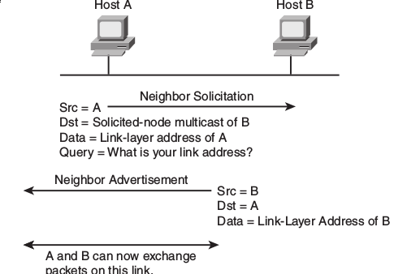

= IPv6
:source-highlighter: pygments
:language: ruby

== Addressing

- 128 bits
- represented in hexadecimal and uses colon-separated fields of 16 bits.

=== IPv4 vs IPv6

- you can configure multiple ipv6 addresses on a logical or physical interface with equal precedence on IOS (only one primary
  ipv4 with optional secondary address)
- automatic configuration of globally unique address (without the need of DHCP)
- built-in neighbor discovery of neighbors, routers and gateways

=== Address abbreviation rules

- Whenever one or more successive 16-bit groups in an IPv6 address consist of all 0s, that
portion of the address can be omitted and represented by two colons (::). The two-colon
abbreviation can be used only once in an address, to eliminate ambiguity.

- When a 16-bit group in an IPv6 address begins with one or more 0s, the leading 0s can be
omitted. This option applies regardless of whether the double-colon abbreviation method is
used anywhere in the address.

----
2001:0001:0000:0000:00A1:0CC0:01AB:397A 

2001:1:0:0:A1:CC0:1AB:397A
2001:0001::00A1:0CC0:01AB:397A
2001:1::A1:CC0:1AB:397A
----

=== Address types

[options="header",cols="30,15,60"]
|===
| Address Type | Range | Application
| Aggregatable global unicast | 2000::/3|  Host-to-host communication; same as IPv4 unicast.
| Multicast | FF00::/8 | One-to-many and many-to-many
communication; same as IPv4 multicast.
| Anycast | Same as Unicast | Application-based, including load balancing,
optimizing traffic for a particular service, and
redundancy. Relies on routing metrics to
determine the best destination for a particular
host.
| Link-local  unicast | FE80::/10 |  Connected-link communications.
| Solicited-node multicast | FF02::1:FF00:0/104 | Neighbor solicitation.
|===

==== Unicast

===== Aggregatable global addresses

- Begin with binary 001 (hexadeximal= 2000::/3)

image::images/ipv6-unicast-address-format.png[height=150]

===== Link-local addresses

- starts with FE80::/10
- follows by 54 bits set to 0
- Interface ID 

- routers do not forward link-local traffic to other segments.

===== IPv4-compatible addresses

- one option is to have first 96 bits set to 0 

----
0:0:0:0:0:10:10:100:16
::10:10:100:16
::A:A:64:10
----

===== Assign an IPv6 unicast address to a router interface

First, enable ipv6 on the router

----
(config)# ipv6 unicast-routing
----

Configure a global unicast address

----
(config-if)# ipv6 address 2014:10:12::19:66/64
----

Router automatically configure a link local address on all IPv6 enabled interfaces.
However, you can explicitly configure one 

----
(config-if)# ipv6 address fe80::1 link-local
----

==== Multicast

===== IPv6 multicast address format

- begin with FF as the first octect, or FF00::/8
- the second octet specifies lifetime (permanent or temporary) and the scope (node, link, site, organization, global)

image::images/ipv6-multicast-address-format.png[]

.IPv6 Multicast Well-Known Addresses
[format="csv", options="header"]
|===
Function, Multicast Group, IPv4 Equivalent
All hosts , FF02::1,  Subnet broadcast address
All Routers, FF02::2, 224.0.0.2
OSPFv3 routers, FF02::5 ,224.0.0.5
OSPFv3 designated routers ,FF02::6 ,224.0.0.6
EIGRP routers ,FF02::A, 224.0.0.10
PIM routers, FF02::D ,224.0.0.13
|===

Each router must join the *solicited-node group* (FF02::1:FF00:0000/104)  for all unicast and anycast traffic.
The last 24 bits come from the corresponding last 24 bits of the unicast or anycast address.
The *neighbor discovery* process uses solicited-node addresses.

==== Anycast

Anycast addresses can be assigned to any number of hosts that provide the same service; when other hosts access this
service, the specific server they hit is determined by the unicast routing metrics on the path to that
particular group of servers. This provides geographic differentiation, enhanced availability, and
load balancing for the service.

-----
(config-if)# ipv6 address 3001:fffe::104/64 anycast
-----

All IPv6 routers additionally must support the subnet router anycast address. This anycast address
is a prefix followed by all 0s in the interface ID portion of the address. Hosts can use a subnet
router anycast address to reach a particular router on the link identified by the prefix given in the
subnet router anycast address.

==== The unspecified address

- represented by **::**
- used as source address by an interface that has not yet learned its unicast addresses.
- cannot be assigned to an interface
- cannot be used as a destination address

==== how to embed an RP address within a multicast group address 

RFC 2373

Given address 2001:DB*:0717::A, 
Follow the structure FF__7__**x**:0**y**30:2001:DB8:0717::**group**

- FF for a multicast address
- 7 indicates that the RP address is embedded in the multicast address
- x for the multicast scope 
    * 1 node-local
    * 2 link-local
    * 5 site-local
    * 8 organization-local
    * E global
    * F reserved
- 0 in the first character of the second hextet
- y for the RP interface ID from 1 to F
- 30 for the mask for the network (0x30 = decimal 48)
- remaining hextets for the network prefix

=== IPv6 address autoconfiguration

Stateful autoconfiguration::
- assigns a host its entire 128-bit address using DHCP

Stateless autoconfiguration::
- assignes a host a 64-bit prefix, and the host derive the last bit using EUI-64 process.

==== EUI-64 address

. split 48-bit MAC address in two parts
. place FFFE in the middle
. set to 1 the universal/local bit (7th bit in the interface id )

Given the IPv6 prefix 2001:128:1f:633 and MAC address 00:07:85:80:71:B8,
the resulting EUI-address is 2001:128:1f:633:**2**07:85**FF:FE**80:71B8/64

----
(config-if)# ipv6 address 2001:128:1f:633::/64 eui-64
----

== Basic  IPv6 functionality protocols

=== Neighbor discovery

- RFC 2461
- discover and track other IPv6 hosts on connected interfaces
- uses ICMPv6 messages and Solicited-node multicast addresses

- major roles

**  Stateless address autoconfiguration (detailed in RFC 2462)
**  Duplicate address detection (DAD)
**  Router discovery
**  Prefix discovery
**  Parameter discovery (link MTU, hop limits)
**  Neighbor discovery
**  Neighbor address resolution (replaces ARP, both dynamic and static)
**  Neighbor and router reachability verification

.ICMPv6 messages used by ND
//add the table here pp 896

==== Neighbor advertisements

- host advertises their pr
- source addresses
- destination addresses
- icmp type, code: 134,0

==== Neighbor solicitation

-  NS messages to find the link-layer of a specific neighbor
- source address: manual assigned or :: 
- destination address: target address or solicited-node multicast address 
- icmp type, code: 135,0

- uses in 3 operations: duplicate address detection, neighbor reachability verification, layer 3 to layer 2 address resolution.

[NOTE]
IPv6 does not include ARP as a protocol but rather integrates the same functionality into ICMP as part of neighbor discovery.
The response to an NS message is an NA message .

.Neighbor discovery between two hosts

==== Router advertisement 

- routers advertise their presence and link prefixes, mtu, hop limits
- source address: router's link-local address
- destination address: all-nodes FF02::1 for periodic broadcasts, querying host address for response
- icmp type, code: 134,0

A Cisco IPv6 router begins sending RA messages for each of its configured interface prefixes
when the *ipv6 unicast-routing* command is configured. You can change the default RA interval
(200 seconds) using the command *ipv6 nd ra-interval*. Router advertisements on a given interface
include all of the 64-bit IPv6 prefixes configured on that interface. This allows for stateless address
autoconfiguration using EUI-64 to work properly. RAs also include the link MTU, hop limits, and
whether a router is a candidate default router.

IPv6 routers send periodic RA messages to inform hosts about the IPv6 prefixes used on the link
and to inform hosts that the router is available to be used as a default gateway. 
By default, a Cisco router running IPv6 on an interface advertises itself as a candidate default router. 

If you do not want a router to advertise itself as a default candidate, 
use the command *ipv6 nd ra-lifetime 0* . By
sending RAs with a lifetime of 0, a router still informs connected hosts of its presence, but tells
connected hosts not to use it to reach hosts off the subnet.

If, for some reason, you wanted to hide the presence of a router entirely in terms of router
advertisements, you can disable router advertisements on that router by issuing the ipv6 nd
suppress-ra command.

==== Router solicitation

- Host query for the presence of routers on the link
- source address: querying host interface, or :: if not assigned
- destination address: FF02::2
- icmp type, code : 133,0

At startup, IPv6 hosts can send Router Solicitation (RS) messages to the all-routers multicast
address. Hosts do this to learn the addresses of routers on a given link, as well as their various
parameters, without waiting for a periodic RA message. If a host has no configured IPv6 address,
it sends an RS using the unspecified address as the source. If it has a configured address, it sources
the RS from the configured address.

==== Duplicate address Detection

//change this to an algorithm
To verify that autoconfigured or statically address is unique,
the host sends an NS message to its own autoconfigured address's corresponding solicited-node multicast address.
This message is sourced from the unspecified address ::. 
In the target address field in the NS is the address the host seeks to verify.
If an NA from another host results, the sending host knows that the address is not unique
- 

==== Neighbor unreachability detection

2 options:

* a host sends a probe to the desired host's solicited-node multicast address and receives an RA or an NA in response.
* a host, in communication with the desired host, receives a clue from higher-layer protocol (e.g. TCP ACK)

=== ICMPv6

- RFC 2463
- two groups of messages: error reporting messages and informational messages
- IOS implements ICMP rate limiting by setting the minimum interval between error messages and build a token bucket

Limit ICMPv6 error messages with default interval 100 ms , and default token-bucket size 10.

-----
(config)# ipv6 icmp error-interval seconds ???
-----

==== Unicast reverse path forwarding

- protects router from DoS attacks from spoofed IPv6 host address.
- performs a recursive lookup in the ipv6 routing table 
  to verify that the packet came in on the correct interface.

//check this command

-----
(config-if)# ipv6 verify unicast reverse-path
-----

=== DNS

- provides resolution of domain names
- DNS records: AAAA (RFC 1886), A6 (RFC 2874)

=== CDP 

- Cisco Discovery Protocol
- provides extensive information about the configuration and functionality of Cisco devices.

Display IPv6 information transmitted in CDP, use the *detail* keyword 

-------
# show cdp neighbors detail
-------

=== DHCP

- RFC 3315

Two conditions can cause a host to use DHCPv6:

- The host is explicitly configured to use DHCPv6 based on an implementation-specific setting.
- An IPv6 router advertises in its RA messages that it wants hosts to use DHCPv6 for
addressing. Routers do this by setting the M flag (Managed Address Configuration) in RAs.

To use stateful autoconfiguration, a host sends a DHCP request to one of two well-known IPv6
multicast addresses on UDP port 547:

- FF02::1:2, all DHCP relay agents and servers
- FF05::1:3, all DHCP servers

The DHCP server then provides the necessary configuration information in reply to the host on
UDP port 546. This information can include the same types of information used in an IPv4
network, but additionally it can provide information for multiple subnets, depending on how the
DHCP server is configured.

To configure a Cisco router as a DHCPv6 server, 
you first configure a DHCP pool, just as in IPv4
then enable the DHCPv6 service using the *ipv6 dhcp server pool-name*

=== Access lists

Similar with IPv4 access lists except that:

- Because Neighbor Discovery is a key protocol in IPv6 networks, access lists implicitly permit
ND traffic. This is necessary to avoid breaking ND’s ARP-like functionality. You can override
this implicit-permit behavior using deny statements in IPv6 access lists.

- To configure an interface to filter traffic using an access list, 
use the *ipv6 traffic-filter access-list-name {in | out}* command.

- IPv6 access lists are always named; they cannot be numbered (unless you use a number as a name).
- IPv6 access lists are configured in named access-list configuration mode, which is like IPv4
named access-list configuration mode. However, you can also enter IPv4-like commands that
specify an entire access-list entry on one line. The router will convert it to the correct
configuration commands for named access-list configuration mode.

== IPv6 routing

=== Static routes

Similar to IPv4 static routes except that:

- An IPv6 static route to an interface has an administrative distance of 1, not 0 as in IPv4.
- An IPv6 static route to a next-hop IP address also has an administrative distance of 1, like IPv4.
- Floating static routes work the same way in IPv4 and IPv6.
- An IPv6 static route to a broadcast interface type, such as Ethernet, must also specify a next-
hop IPv6 address because

** IPv6 does not use ARP
** There is no concept of proxy ARP

----
(config)# ipv6 route 2001:128::/64 2001::207:85FF:FE80:7208
----

----
show ipv6 route
----

=== OSPFv3

=== EIGRPv6

== ospfv3 

- router id is highest ipv4 loopback, highest ipv4, or *router-id* id command 

== readings

http://www.cisco.com/c/en/us/td/docs/ios/12_4/interface/configuration/guide/inb_tun.html#wp1045782[Implement tunnels]

http://www.cisco.com/en/US/docs/ios/ipv6/configuration/guide/ip6-ospf.html#wp1069821[implementing OSPF for IPv6]

