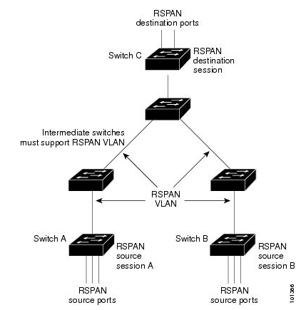

= SPAN and RSPAN

== Concepts

SPAN (Switch Port Analyzer) mirrors received and/or transmitted traffic on 
source ports and received traffic on source ports or source VLANs,
to a destination port for analysis.

=== Local SPAN

Local SPAN supports a SPAN session entirely within one switch; all source ports
or source VLANs and destination ports are in the same switch. Local SPAN copies
traffic from one or more source ports in any VLAN or from one or more VLANs to
a destination port for analysis. 

For example, in <<span-configuration>>, all traffic on port 5 (the source port) is
mirrored to port 10 (the destination port). A network analyzer on port 10
receives all network traffic from port 5 without being physically attached to
port 5.

[[span-configuration]]
.Example SPAN Configuration
image::images/span-configuration.png[]

Only traffic that enters or leaves source ports or traffic that enters source
VLANs can be monitored by using SPAN; traffic that gets routed to ingress
source ports or source VLANs cannot be monitored. For example, if incoming
traffic is being monitored, traffic that gets routed from another VLAN to the
source VLAN is not monitored; however, traffic that is received on the source
VLAN and routed to another VLAN is monitored.

=== Remote SPAN

RSPAN extends SPAN by enabling remote monitoring of multiple switches across
your network. 
The traffic for each RSPAN session is carried over a user-specified RSPAN VLAN 
that is dedicated for that RSPAN session in all participating switches. 
The SPAN traffic from the sources is copied onto the
RSPAN VLAN through a reflector port and then forwarded over trunk ports that
are carrying the RSPAN VLAN to any RSPAN destination sessions monitoring the
RSPAN VLAN, as shown in <<rspan-configuration>>.

Each RSPAN source switch must have either ports or VLANs as RSPAN source.
The destination is always a physical port.

[[rspan-configuration]]
.Example of RSPAN Configuration

SPAN and RSPAN do not affect the switching of network traffic on source ports
or source VLANs; a copy of the packets received or sent by the source
interfaces are sent to the destination interface.

You can analyze network traffic passing through ports or VLANs by using SPAN to
send a copy of the traffic to another port on the switch that has been
connected to a SwitchProbe device or other Remote Monitoring (RMON) probe or
security device.

You can use the SPAN or RSPAN destination port to inject traffic from a network
security device. For example, if you connect a Cisco Intrusion Detection System
(IDS) Sensor Appliance to a destination port, the IDS device can send TCP Reset
packets to close down the TCP session of a suspected attacker.

=== SPAN sessions

SPAN sessions (local or remote) allow you to monitor traffic on one or more
ports, or one or more VLANs, and send the monitored traffic to one or more
destination ports. 

A local SPAN session is an association of a destination port with source ports
or source VLANs, all on a single network device. 
Local SPAN does not have separate source and destination sessions. 
Local SPAN sessions gather a set of ingress and egress packets specified by the user 
and form them into a stream of SPAN data, which is directed to the destination port.

RSPAN consists of at least one RSPAN source session, an RSPAN VLAN, and at
least one RSPAN destination session. 
You separately configure RSPAN source sessions and RSPAN destination sessions on different network devices. 
To configure an RSPAN source session on a device, 
you associate a set of source ports or source VLANs with an RSPAN VLAN. 
The output of this session is the stream of SPAN packets that are sent to the RSPAN VLAN. 
To configure an RSPAN destination session on another device, 
you associate the destination port with the RSPAN VLAN. 
The destination session collects all RSPAN VLAN traffic and sends it out the RSPAN destination port.

An RSPAN source session is very similar to a local SPAN session, except for
where the packet stream is directed. In an RSPAN source session, SPAN packets
are relabeled with the RSPAN VLAN ID and directed over normal trunk ports to
the destination switch.

An RSPAN destination session takes all packets received on the RSPAN VLAN,
strips off the VLAN tagging, and presents them on the destination port. 
Its purpose is to present a copy of all RSPAN VLAN packets (except Layer 2 control
packets) to the user for analysis.

There can be more than one source session and more than one destination session
active in the same RSPAN VLAN. There can also be intermediate switches
separating the RSPAN source and destination sessions. These switches need not
be capable of running RSPAN, but they must respond to the requirements of the
RSPAN VLAN. 

=== Restrictions 

- Sources can be ports or VLANs, 
but you cannot mix source ports and source VLANs in the same session.

- The switch supports up to two source sessions (local SPAN and RSPAN source
  sessions). You can run both a local SPAN and an RSPAN source session in the
  same switch. The switch supports a total of 66 source and RSPAN destination
  sessions.

- maximum of 64 destination ports.

- switched or routed ports can be configured as SPAN source or destination ports.

- You can configure two separate SPAN or RSPAN source sessions with separate or
  overlapping sets of SPAN source ports and VLANs. Both switched and routed
  ports can be configured as SPAN sources and destinations.

- SPAN sessions do not interfere with the normal operation of the switch.
  However, an oversubscribed SPAN destination, for example, a 10-Mb/s port
  monitoring a 100-Mb/s port, can result in dropped or lost packets.

- When RSPAN is enabled, each packet being monitored is transmitted twice, once
  as normal traffic and once as a monitored packet. Therefore monitoring a
  large number of ports or VLANs could potentially generate large amounts of
  network traffic.

- You can configure SPAN sessions on disabled ports; however, a SPAN session
  does not become active unless you enable the destination port and at least
  one source port or VLAN for that session.

- The switch does not support a combination of local SPAN and RSPAN in a single
  session. That is, an RSPAN source session cannot have a local destination
  port, an RSPAN destination session cannot have a local source port, and an
  RSPAN destination session and an RSPAN source session that are using the same
  RSPAN VLAN cannot run on the same switch. 

- When you configure a destination port,
  its original configuration is overriden.
  If the SPAN configuration is removed,
  the original configuration on that port is restored

- only on SPAN/RSPAN session can send traffic to a single destination port.

=== Monitored traffic 

SPAN sessions include these traffic types:

Receive (Rx) SPAN::

The goal of receive (or ingress) SPAN is to monitor as much as possible all the
packets received by the source interface or VLAN before any modification or
processing is performed by the switch. A copy of each packet received by the
source is sent to the destination port for that SPAN session. You can monitor a
series or range of ingress ports or VLANs in a SPAN session.
+
Packets that are modified because of routing or QoS are copied before modification.
+
Features that can cause a packet to be dropped during receive processing have
no effect on ingress SPAN; the destination port receives a copy of the packet
even if the actual incoming packet is dropped. These features include IP
standard and extended input access control lists , QoS policing,
VLAN ACLs. 

Transmit (Tx) SPAN::

The goal of transmit (or egress) SPAN is to monitor as much
as possible all the packets sent by the source interface after all modification
and processing is performed by the switch. A copy of each packet sent by the
source is sent to the destination port for that SPAN session. The copy is
provided after the packet is modified.
+
Only one egress source port is allowed per SPAN session. VLAN monitoring is not
supported in the egress direction.
+
Packets that are modified because of routing (e.g. TTL or MAC-address modification) 
are duplicated at the destination port. 
On packets that are modified because of QoS, the modified packet might not have
the same DSCP (IP packet) or CoS (non-IP packet) as the SPAN source.
+
Some features that can cause a packet to be dropped during transmit processing
might also affect the duplicated copy for SPAN. These features include VLAN
maps, IP standard and extended output ACLs on multicast packets, and egress QoS
policing. In the case of output ACLs, if the SPAN source drops the packet, the
SPAN destination would also drop the packet. In the case of egress QoS
policing, if the SPAN source drops the packet, the SPAN destination might not
drop it. If the source port is oversubscribed, the destination ports will have
different dropping behavior.

Both::

In a SPAN session, you can monitor a single port for both received and
sent packets. This is the default.

The default configuration for local SPAN session ports is to send all packets
untagged. SPAN also does not normally monitor BPDU, CDP, VTP, DTP, STP, PAgP.
However, when you enter the encapsulation replicate keywords when configuring a destination port, 
these changes occur:

- Packets are sent on the destination port with the same (ISL or 802,1Q) encapsulation
that they had on the source port.

- Packets of all types, including BPDU and Layer 2 protocol packets, are
monitored.

Therefore, a local SPAN session with encapsulation replicate enabled can have a
mixture of untagged, ISL, and IEEE 802.1Q tagged packets appear on the
destination port.

Switch congestion can cause packets to be dropped at ingress source ports,
egress source ports, or SPAN destination ports. In general, these
characteristics are independent of one another. For example:

- A packet might be forwarded normally but dropped from monitoring due to an
oversubscribed SPAN destination port.

- An ingress packet might be dropped from normal forwarding, but still appear on
the SPAN destination port.

- An egress packet dropped because of switch congestion is also dropped from
egress SPAN.

In some SPAN configurations, multiple copies of the same source packet are sent
to the SPAN destination port. For example, a bidirectional (both Rx and Tx)
SPAN session is configured for the Rx monitor on port A and Tx monitor on port B. 
If a packet enters the switch through port A and is switched to port B, both
incoming and outgoing packets are sent to the destination port. Both packets
are the same (unless a Layer-3 rewrite occurs, in which case the packets are
different because of the packet modification). 

=== Source Ports

A source port (also called a monitored port) is a switched or routed port that
you monitor for network traffic analysis. In a local SPAN session or RSPAN
source session, you can monitor source ports or VLANs for traffic in one or
both directions. The switch supports any number of source ports (up to the
maximum number of available ports on the switch) and any number of source VLANs
(up to the maximum number of VLANs supported). However, the switch supports a
maximum of two sessions (local or RSPAN) with source ports or VLANs, and you
cannot mix ports and VLANs in a single session.

A source port has these characteristics:

- It can be monitored in multiple SPAN sessions.
- Each source port can be configured with a direction (ingress, egress, or
  both) to monitor.
- It can be any port type (EtherChannel, Fast Ethernet, Gigabit Ethernet, h).
- For EtherChannel sources, you can monitor traffic for the entire EtherChannel
  or individually on a physical port as it participates in the port channel.
- It can be an access port, trunk port, routed port, or voice VLAN port.
- It cannot be a destination port.
- Source ports can be in the same or different VLANs.
- You can monitor multiple source ports in a single session.

=== Source VLANs

VLAN-based SPAN (VSPAN) is the monitoring of the network traffic in one or more VLANs. 
The SPAN or RSPAN source interface in VSPAN is a VLAN ID, and traffic is monitored on all the ports for that VLAN.

VSPAN has these characteristics:

- All active ports in the source VLAN are included as source ports and can be monitored in either or both directions.

- On a given port, only traffic on the monitored VLAN is sent to the destination port.

- If a destination port belongs to a source VLAN, it is excluded from the source list and is not monitored.

- If ports are added to or removed from the source VLANs, the traffic on the source VLAN received by those ports is added to or removed from the sources being monitored.

- You cannot use filter VLANs in the same session with VLAN sources.

- You can monitor only Ethernet VLANs. 

=== VLAN Filtering

When you monitor a trunk port as a source port, by default, all VLANs active on the trunk are monitored. You can limit SPAN traffic monitoring on trunk source ports to specific VLANs by using VLAN filtering.

- VLAN filtering applies only to trunk ports or to voice VLAN ports.

- VLAN filtering applies only to port-based sessions and is not allowed in sessions with VLAN sources.

- When a VLAN filter list is specified, only those VLANs in the list are monitored on trunk ports or on voice VLAN access ports.

- SPAN traffic coming from other port types is not affected by VLAN filtering; that is, all VLANs are allowed on other ports.

- VLAN filtering affects only traffic forwarded to the destination SPAN port and does not affect the switching of normal traffic. 

=== Destination port

Each local SPAN session or RSPAN destination session must have a destination port (also called a monitoring port) that receives a copy of traffic from the source ports or VLANs and sends the SPAN packets to the user, usually a network analyzer.

A destination port has these characteristics:

- For a local SPAN session, the destination port must reside on the same switch
  as the source port. For an RSPAN session, it is located on the switch
  containing the RSPAN destination session. There is no destination port on a
  switch running only an RSPAN source session.

- When a port is configured as a SPAN destination port, the configuration
  overwrites the original port configuration. When the SPAN destination
  configuration is removed, the port reverts to its previous configuration. If
  a configuration change is made to the port while it is acting as a SPAN
  destination port, the change does not take effect until the SPAN destination
  configuration had been removed.

- If the port was in an EtherChannel group, it is removed from the group while
  it is a destination port. If it was a routed port, it is no longer a routed
  port.

- It can be any Ethernet physical port.

- It cannot be a secure port.

- It cannot be a source port.

- It cannot be an EtherChannel group or a VLAN.

- It can participate in only one SPAN session at a time (a destination port in
  one SPAN session cannot be a destination port for a second SPAN session).

- When it is active, incoming traffic is disabled. The port does not transmit
  any traffic except that required for the SPAN session. Incoming traffic is
  never learned or forwarded on a destination port.

- If ingress traffic forwarding is enabled for a network security device, the
  destination port forwards traffic at Layer 2.

- It does not participate in any of the Layer 2 protocols (STP, VTP, CDP, DTP,
  PagP).

- A destination port that belongs to a source VLAN of any SPAN session is
  excluded from the source list and is not monitored.

- The maximum number of destination ports in a switch is 64.

Local SPAN and RSPAN destination ports behave differently regarding VLAN
tagging and encapsulation:

- For local SPAN, if the encapsulation replicate keywords are specified for the
  destination port, these packets appear with the original encapsulation
  (untagged, ISL, or IEEE 802.1Q). If these keywords are not specified, packets
  appear in the untagged format. Therefore, the output of a local SPAN session
  with encapsulation replicate enabled can contain a mixture of untagged, ISL,
  or IEEE 802.1Q-tagged packets.

- For RSPAN, the original VLAN ID is lost because it is overwritten by the
  RSPAN VLAN identification. Therefore, all packets appear on the destination
  port as untagged. 

=== RSPAN VLAN

The RSPAN VLAN carries SPAN traffic between RSPAN source and destination sessions. It has these special characteristics:

- All traffic in the RSPAN VLAN is always flooded.

- No MAC address learning occurs on the RSPAN VLAN.

- RSPAN VLAN traffic only flows on trunk ports.

- RSPAN VLANs must be configured in VLAN configuration mode by using the remote-span VLAN configuration mode command.

- STP can run on RSPAN VLAN trunks but not on SPAN destination ports.

- An RSPAN VLAN cannot be a private-VLAN primary or secondary VLAN.

For VLANs 1 to 1005 that are visible to VLAN Trunking Protocol (VTP), the VLAN
ID and its associated RSPAN characteristic are propagated by VTP. If you assign
an RSPAN VLAN ID in the extended VLAN range (1006 to 4094), you must manually
configure all intermediate switches.

It is normal to have multiple RSPAN VLANs in a network at the same time with
each RSPAN VLAN defining a network-wide RSPAN session. That is, multiple RSPAN
source sessions anywhere in the network can contribute packets to the RSPAN
session. It is also possible to have multiple RSPAN destination sessions
throughout the network, monitoring the same RSPAN VLAN and presenting traffic
to the user. The RSPAN VLAN ID separates the sessions. 

=== Interaction with other features

Routing ::

SPAN does not monitor routed traffic. VSPAN only monitors traffic that enters or exits the switch, not traffic that is routed between VLANs. For example, if a VLAN is being Rx-monitored and the switch routes traffic from another VLAN to the monitored VLAN, that traffic is not monitored and not received on the SPAN destination port.

STP::
A destination port does not participate in STP while its SPAN or RSPAN session is active. The destination port can participate in STP after the SPAN or RSPAN session is disabled. On a source port, SPAN does not affect the STP status. STP can be active on trunk ports carrying an RSPAN VLAN.

CDP::
A SPAN destination port does not participate in CDP while the SPAN session is active. After the SPAN session is disabled, the port again participates in CDP.

VTP::
You can use VTP to prune an RSPAN VLAN between switches.

VLAN and trunking::
You can modify VLAN membership or trunk settings for source or destination ports at any time. However, changes in VLAN membership or trunk settings for a destination port do not take effect until you remove the SPAN destination configuration. Changes in VLAN membership or trunk settings for a source port immediately take effect, and the respective SPAN sessions automatically adjust accordingly.

EtherChannel::
You can configure an EtherChannel group as a source port but not as a SPAN destination port. When a group is configured as a SPAN source, the entire group is monitored.
+
If a physical port is added to a monitored EtherChannel group, the new port is added to the SPAN source port list. If a port is removed from a monitored EtherChannel group, it is automatically removed from the source port list.
+
A physical port that belongs to an EtherChannel group can be configured as a SPAN source port and still be a part of the EtherChannel. In this case, data from the physical port is monitored as it participates in the EtherChannel. However, if a physical port that belongs to an EtherChannel group is configured as a SPAN destination, it is removed from the group. After the port is removed from the SPAN session, it rejoins the EtherChannel group. Ports removed from an EtherChannel group remain members of the group, but they are in the inactive or suspended state.
+
If a physical port that belongs to an EtherChannel group is a destination port and the EtherChannel group is a source, the port is removed from the EtherChannel group and from the list of monitored ports.

Multicasting::

Multicast traffic can be monitored. For egress and ingress port monitoring, only a single unedited packet is sent to the SPAN destination port. It does not reflect the number of times the multicast packet is sent.

Private VLAN::

A private-VLAN port cannot be a SPAN destination port.

Secure port::

A secure port cannot be a SPAN destination port.
+
For SPAN sessions, do not enable port security on ports with monitored egress when ingress forwarding is enabled on the destination port. For RSPAN source sessions, do not enable port security on any ports with monitored egress.
+
An IEEE 802.1x port can be a SPAN source port. You can enable IEEE 802.1x on a port that is a SPAN destination port; however, IEEE 802.1x is disabled until the port is removed as a SPAN destination.
+
For SPAN sessions, do not enable IEEE 802.1x on ports with monitored egress when ingress forwarding is enabled on the destination port. For RSPAN source sessions, do not enable IEEE 802.1x on any ports that are egress monitored. 

== Configuration tasks

=== Default SPAN and RSPAN configuration

[format="dsv", options="header", cols="40,60"]
|====
Feature                               : Default Setting
SPAN state (SPAN and RSPAN)           : Disabled.
Source port traffic to monitor        : Both received and sent traffic (both).
Encapsulation type (destination port) : Native form (untagged packets).
Ingress forwarding (destination port) : Disabled
VLAN filtering                        : On a trunk interface used as a source port, all VLANs are monitored.
RSPAN VLANs                           : None configured.
|====

=== Configuration guidelines

==== SPAN

- For SPAN sources, you can monitor traffic for a single port or VLAN or a series or range of ports or VLANs for each session. You cannot mix source ports and source VLANs within a single SPAN session.

- The destination port cannot be a source port; a source port cannot be a destination port.

- You cannot have two SPAN sessions using the same destination port.

- When you configure a switch port as a SPAN destination port, it is no longer a normal switch port; only monitored traffic passes through the SPAN destination port.

- Entering SPAN configuration commands does not remove previously configured SPAN parameters. You must enter the no monitor session {session_number | all | local | remote} global configuration command to delete configured SPAN parameters.

- For local SPAN, outgoing packets through the SPAN destination port carry the original encapsulation headers—untagged, ISL, or IEEE 802.1Q—if the encapsulation replicate keywords are specified. If the keywords are not specified, the packets are sent in native form. For RSPAN destination ports, outgoing packets are not tagged.

- You can configure a disabled port to be a source or destination port, but the SPAN function does not start until the destination port and at least one source port or source VLAN are enabled.

- You can limit SPAN traffic to specific VLANs by using the filter vlan keyword. If a trunk port is being monitored, only traffic on the VLANs specified with this keyword is monitored. By default, all VLANs are monitored on a trunk port.

- You cannot mix source VLANs and filter VLANs within a single SPAN session.

- Catalyst 3560-24PS and 3560-48PS switches have hardware limitations related to SPAN. An egress SPAN copy of routed unicast traffic might show an incorrect destination MAC address on both local and remote SPAN sessions. This limitation does not apply to bridged packets. The workaround for local SPAN is to use the replicate option.

- On Catalyst 3560-24PS and 3560-48PS switches, egress SPAN routed packets (both unicast and multicast) show the incorrect source MAC address. For local SPAN packets with native encapsulation on the destination port, the packet shows the MAC address of VLAN 1. This problem does not appear with local SPAN when the encapsulation replicate option is used. This limitation does not apply to bridged packets. The workaround is to use the encapsulate replicate keywords in the monitor session global configuration command. 

==== RSPAN

- All the items in the previous section apply to RSPAN

- As RSPAN VLANs have special properties, you should reserve a few VLANs across your network for use as RSPAN VLANs; do not assign access ports to these VLANs.

- You can apply an output ACL to RSPAN traffic to selectively filter or monitor specific packets. Specify these ACLs on the RSPAN VLAN in the RSPAN source switches.

- For RSPAN configuration, you can distribute the source ports and the destination ports across multiple switches in your network.

- RSPAN does not support BPDU packet monitoring or other Layer 2 switch protocols.

- The RSPAN VLAN is configured only on trunk ports and not on access ports. To avoid unwanted traffic in RSPAN VLANs, make sure that the VLAN remote-span feature is supported in all the participating switches.

- Access ports (including voice VLAN ports) on the RSPAN VLAN are put in the inactive state.

- RSPAN VLANs are included as sources for port-based RSPAN sessions when source trunk ports have active RSPAN VLANs. RSPAN VLANs can also be sources in SPAN sessions. However, since the switch does not monitor spanned traffic, it does not support egress spanning of packets on any RSPAN VLAN identified as the destination of an RSPAN source session on the switch.

- You can configure any VLAN as an RSPAN VLAN as long as these conditions are met:

–The same RSPAN VLAN is used for an RSPAN session in all the switches.

–All participating switches support RSPAN.

- We recommend that you configure an RSPAN VLAN before you configure an RSPAN source or a destination session.

- If you enable VTP and VTP pruning, RSPAN traffic is pruned in the trunks to prevent the unwanted flooding of RSPAN traffic across the network for VLAN IDs that are lower than 1005. 

=== Remove any existing SPAN configuration

----
no monitor session {session_number | all | local | remote}
----

For session_number, the range is 1 to 66.

Specify *all* to remove all SPAN sessions, *local* to remove all local sessions, or *remote* to remove all remote SPAN sessions. 

=== Create a local SPAN session

----
monitor session number source {interface _id | vlan id} [, | -] [both | rx | tx]
monitor session number destination {interface _id | vlan id} [, | -] [both | rx | tx]
----

For session_number, the range is 1 to 66.

For interface-id, specify the source port or source VLAN to monitor.

- For source interface-id, specify the source port to monitor. Valid interfaces include physical interfaces and port-channel logical interfaces (port-channel port-channel-number). Valid port-channel numbers are 1 to 48.

- For vlan-id, specify the source VLAN to monitor. The range is 1 to 4094 (excluding the RSPAN VLAN).

(Optional) [, | -] Specify a series or range of interfaces. Enter a space before and after the comma; enter a space before and after the hyphen.

- You can use the *monitor session* _session_number_ *source* command multiple times to configure multiple source ports. 

- A single session can include multiple sources (ports or VLANs), defined in a series of commands, but you cannot combine source ports and source VLANs in one session.

=== Specify a SPAN session and the destination port

----
monitor session number 
  destination {interface _id  [, | -] [both | rx | tx]
  [encapsulation replicate]}
----

The session number  must be the same as the source session number.

=== Specify VLANs to filter

----
monitor session session_number filter vlan vlan-id [, | -]
----

For vlan-id, the range is 1 to 4094.

(Optional) Use a comma (,) to specify a series of VLANs, or use a hyphen (-) to specify a range of VLANs. Enter a space before and after the comma; enter a space before and after the hyphen. 

=== Configure a VLAN as an RSPAN VLAN

First create a new VLAN to be the RSPAN VLAN for the RSPAN session. You must
create the RSPAN VLAN in all switches that will participate in RSPAN. If the
RSPAN VLAN-ID is in the normal range (lower than 1005) and VTP is enabled in
the network, you can create the RSPAN VLAN in one switch, and VTP propagates it
to the other switches in the VTP domain. For extended-range VLANs (greater than
1005), you must configure RSPAN VLAN on both source and destination switches
and any intermediate switches.

Use VTP pruning to get an efficient flow of RSPAN traffic, or manually delete
the RSPAN VLAN from all trunks that do not need to carry the RSPAN traffic. 

Steps::

. Enter a VLAN ID to create a VLAN, or enter the VLAN ID of an existing VLAN, and enter VLAN configuration mode. The range is 2 to 1001 and 1006 to 4094.
The RSPAN VLAN cannot be VLAN 1 (the default VLAN) or VLAN IDs 1002 through 1005 (reserved for Token Ring and FDDI VLANs).
+
----
vlan vlan-id
----
+
. Configure the VLAN as an RSPAN VLAN. 
+
----
remote-span
exit
----
+
. Specify the RSPAN session and the source port (monitored port). 
+
----
monitor session session_number source {interface interface-id | vlan vlan-id} [, | -] [both | rx | tx] 
----
+
. Specify the RSPAN session and the destination RSPAN VLAN.
+
----
monitor session session_number destination remote vlan vlan-id
----
+
. Configure the RSPAN destination session on a different switch (not the switch on which the source session was configured)
+
----
configure terminal
vlan id
  remote-span
  exit
monitor session { 1-66 | all | local | remote}
monitor session session_number source remote vlan vlan-id
 monitor session session_number destination {interface interface-id [, | -] [ingress {dot1q vlan vlan-id | isl | untagged vlan vlan-id | vlan vlan-id}]} 
end
----
+
[NOTE]
====
Though visible in the command-line help string, encapsulation replicate is not supported for RSPAN. The original VLAN ID is overwritten by the RSPAN VLAN ID, and all packets appear on the destination port as untagged.

(Optional) [, | -] Specify a series or range of interfaces. Enter a space before and after the comma; enter a space before and after the hyphen.

Enter ingress with additional keywords to enable forwarding of incoming traffic on the destination port and to specify the encapsulation type:

- *dot1q vlan* vlan-id: Forward incoming packets with IEEE 802.1Q encapsulation with the specified VLAN as the default VLAN.

- *isl*: Forward ingress packets with ISL encapsulation.

- *untagged vlan* vlan-id or *vlan* vlan-id: Forward incoming packets with untagged encapsulation type with the specified VLAN as the default VLAN. 
====

=== Display SPAN and RSPAN status

----
Switch# show monitor session

Session 1
========== 

Type              : Local Session
Source Ports      :
    RX Only       : None
    TX Only       : None
    Both          : Fa0/4
Source VLANs      :
    RX Only       : None
    TX Only       : None
    Both          : None
Source RSPAN VLAN : None
Destination Ports : Fa0/5
    Encapsulation: DOT1Q
          Ingress: Enabled, default VLAN = 5
Reflector Port    : None
Filter VLANs      : None
Dest RSPAN VLAN   : None
----

