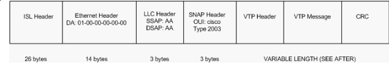
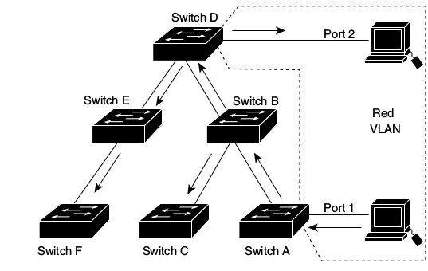
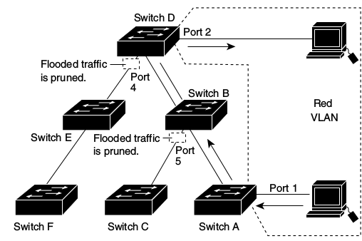

= VTP
:experimental:
:icons: font

menu:Catalyst Configuration guides[http://www.cisco.com/c/en/us/td/docs/switches/lan/catalyst3750x_3560x/software/release/15-0_2_se/configuration/guide/3750x_cg/swvtp.html#pgfId-1035238[Configuring VTP] ]

== Overview

- VTP vlan trunk protocol 
- Cisco-proprietary that distributes VLAN information among Catalyst switches
- Advertises the VLAN Id, Name and Type but not which ports should be in each VLAN
- Eases administrative burden for addition, deletion and renaming of VLANs
- Supports 1005 VLANs (IP base or IP services feature set) or 255 VLANs (LAN base feature set)

== VTP message format

- Encapsulated in ISL or 802.1q frames
- Multicasted to  MAC address: 0100-0CCC-CCCC, LLC code: SNAP (AAAA), Type 2003 in the SNAP Header
- Carried through trunk ports and VLAN 1

.Example: VTP packet encapsulated in ISL frame

- The VTP header contains these fields:
  * VTP protocol version: 1,2,3
  * VTP message types: summary advertisements, subset advertisements, advertisement requests, VTP join messages 
  * management domain length
  * management domain name

=== Summary advertisements

- Informs adjacent Catalysts of the current VTP domain name and the configuration revision number.
- 5 minutes intervals
- When the switch receives a summary advertisement packet, 
  * the switch compares the VTP domain name to its own VTP domain name. 
  * If the name is different, the switch simply ignores the packet. 
  * If the name is the same, the switch then compares the configuration revision to its own revision. 
  * If its own configuration revision is higher or equal, the packet is ignored. 
  * If it is lower, an advertisement request is sent.

.VTP Summary Advert 
["packetdiag", target="vtp-summary-advert-packet-format.png"]
----
diagram {
  colwidth = 32
  node_height = 32
  default_node_color = lightyellow
  default_fontsize = 14

  * Version [len = 8]
  * Code [len = 8]
  * Followers [len = 8]
  * MgmtD Len [len = 8]
  * Management Domain Name (zero-padded to 32 bytes) [len = 32]
  * Configuration Revison Number [len = 32]
  * Updater Identity [len = 32]
  * Update Timestamp (12 bytes) [len = 32]
  * MD5 Digest (16 bytes) [len=32]
}
----

[cols="25,75", options="header"]
|===
| Field            | Description
| Followers        | Indicates that this packet is followed by a Subset Advertisement packet.
| Updater Identity | IP address of the switch that is the last to have incremented the configuration revision.
| Update Timestamp | Date and time of the last increment of the configuration revision.
| MD5 Digest       | If MD5 is configured and used to authenticate the validation of a VTP update.
|===

=== Subset advertisements

- Follows the summary advertisement after addition, deletion or modification of a VLAN.
- Contains a list of VLAN information. 

.VTP Subset advertisements
["packetdiag", target="vtp-subset-advert-packet-format.png"]
----
diagram {
  colwidth = 32
  node_height = 32
  default_node_color = lightyellow
  default_fontsize = 14

  * Version [len = 8]
  * Code [len = 8]
  * Sequence Number [len = 8]
  * MgmtD Len [len = 8]
  * Management Domain Name (zero-padded to 32 bytes) [len = 32]
  * Configuration Revison Number [len = 32]
  * VLAN-info field 1 [len = 32]
  * ................. [len = 32]
  * VLAN-info field n [len = 32]
}
----

Code:: 
value: 0x02 for subset advertisement.

Sequence number:: 
- Identify the packet in the stream of packets that follow a summary advertisement
- Starts with value 1

=== Advertisement request

A switch needs a VTP advertisement request in these situations:

- The switch has been reset.
- The VTP domain name has been changed.
- The switch has received a VTP summary advertisement with a higher configuration revision than its own.

Upon receipt of an advertisement request, a VTP device sends a summary advertisement. 
One or more subset advertisements follow the summary advertisement. This is an example:

.VTP advertisement request
["packetdiag", target="vtp-request-advert-packet-format.png"]
----
diagram {
  colwidth = 32
  node_height = 32
  default_node_color = lightyellow
  default_fontsize = 14

  * Version [len = 8]
  * Code = 0x03 [len = 8]
  * Rsvd [len = 8]
  * MgmtD Len [len = 8]
  * Management Domain Name (zero-padded to 32 bytes) [len = 32]
  * Start-Value [len = 32]
}
----

Start-Value::
This is used in cases in which there are several subset advertisements. 
If the first (n) subset advertisement has been received 
and the subsequent one (n+1) has not been received, 
the Catalyst only requests advertisements from the (n+1)th one.

== VTP domains

- Controls which devices can exchange VTP advertisements
- Defaults to null value 
- Switch inherits VTP domain name of first received advertisement over trunk links
- A switch can only be part of one domain at a time

.Task: Set the VTP domain name
----
(config)# vtp domain <name>
----

== Configuration revision number

- 32-bit 
- Incremented by one for each configuration change
- Higher revision indicates newer database 

== Allowed, active and pruned VLANs

Although a trunk can support VLANs 1–4094, several mechanisms reduce the actual number of
VLANs whose traffic flows over the trunk. First, VLANs can be administratively forbidden from
existing over the trunk using the *switchport trunk allowed* interface subcommand. Also, any
allowed VLANs must be configured on the switch before they are considered active on the trunk.
Finally, VTP can prune VLANs from the trunk, with the switch simply ceasing to forward frames
from that VLAN over the trunk.

The *show interface trunk* command lists the VLANs that fall into each category:

Allowed VLANs ::
Each trunk allows all VLANs by default. However, VLANs can be
removed or added to the list of allowed VLANs by using the switchport trunk allowed
command.

Allowed and active ::
To be active, a VLAN must be in the allowed list for the trunk (based on trunk configuration), 
and the VLAN must exist in the VLAN configuration on the switch.
With PVST+, an STP instance is actively running on this trunk for the VLANs in this list.

Active and not pruned ::
This list is a subset of the “allowed and active” list, with any VTP-pruned VLANs removed.

== VTP modes

You can configure a switch to operate in any one of these VTP modes:

Server::
- Default mode
- Allows addition, deletion and modification of VLAN information
- Changes on server overwrite the rest of the domain
- Configuration saved in NVRAM

.Task: Configure the switch as a VTP server
----
vtp mode server
----

Client::
- Cannot add, remove or modify VLAN information
- Listens for advertisements originated by server, install them and passes them on
- Configuration saved in NVRAM only for VTPv3

.Task: Configure the switch as a VTP client
----
vtp mode client
----

Transparent::
- Keeps a separate VTP database from the rest of the domain
- Does not originate advertisements
- "transparently" passes received advertisements through without installing them
- Can still create, remove or renamed VLANs which are not advertised to neighboring switches.
- Need for some applications like Private VLANs

.Task: Setup VTP transparent mode
----
vtp mode transparent
----

Off (configurable only in CatOS switches)::
- Like VTP transparent mode with the exception that VTP advertisements are not forwarded

.VTP Modes and Features
[cols="70,10,10,10"]
|===
| Function                                                           | Server Mode | Client Mode | Transparent Mode
| Originates VTP advertisements                                      | Yes         | Yes         | No
| Processes received advertisements to update its VLAN configuration | Yes         | Yes         | No
| Forwards received VTP advertisements                               | Yes         | Yes         | Yes
| Saves VLAN configuration in NVRAM or vlan.dat                      | Yes         | Yes         | Yes
| Can create, modify, or delete VLANs using  configuration commands  | Yes         | No          | Yes
|===

== VTP security

- MD5 authentication prevents against certain attack
  * does not prevent against misconfiguration
  * password must be setup manually because switches only exchanges MD5 digest of the password.
  
.Task: Configure VTP authentication
----
(config)# vtp password <string>
----

.Task: Show the VTP password
----
(config)# sh vtp password
----

== VTP pruning

- Problem: 
  * Broadcasts and unknown unicast/multicast frame are flooded everywhere in the broadcast domain
  included through trunks links
  * Manual editing allowed list is a huge administrative overhead

- Solution: VTP pruning
  * Switches advertise what they need
  - All other VLANs are pruned off the trunk link

- Restriction: 
  * Pruning does not work in transparent mode. Why?

=== Pruning eligibility

- When VTP pruning is enabled on a VTP server, 
  pruning is enabled for the entire management domain 
  except for pruning-ineligible VLANS ( Vlan 1, 1002-1005, 1006-4094) 

- Making VLANs pruning-eligible or pruning-ineligible affects pruning eligibility for those VLANs on that trunk only 
  (not on all switches in the VTP domain). 

- VTP pruning takes effect several seconds after you enable it.

== Version

TODO: Add task for this section

- Default: version 1

=== Version 2

- 

=== Version 3

- Supports the whole IEEE 802.1q vlan range up to 4095 ( v1 and v2 support only normal range VLANs 1-1005)
- Can send private LAN information in addition to normal VLAN information.
- Backward compatible with VTP 2
- Add support for databases other than VLAN databases such as MST databases.
- Clear text or hidden password protection

For more information, read http://www.cisco.com/c/en/us/products/collateral/switches/catalyst-6500-series-switches/solution_guide_c78_508010.html[VTP version 3]

.Task: Verify VTP configuration
----
# show vtp status

VTP Version: 3 (capable)
Configuration Revision: 1
Maximum VLANs supported locally: 1005
Number of existing VLANs: 37
VTP Operating Mode: Server
VTP Domain Name: [smartports]
VTP Pruning Mode: Disabled
VTP V2 Mode: Enabled
VTP Traps Generation: Disabled
MD5 digest : 0x26 0xEE 0x0D 0x84 0x73 0x0E 0x1B 0x69
Configuration last modified by 172.20.52.19 at 7-25-08 14:33:43
Local updater ID is 172.20.52.19 on interface Gi5/2 (first layer3 interface fou)
VTP version running: 2
----

== Troubleshooting

http://www.cisco.com/c/en/us/support/docs/lan-switching/vtp/98155-tshoot-vlan.html#topic9

